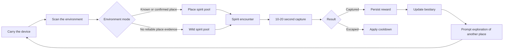
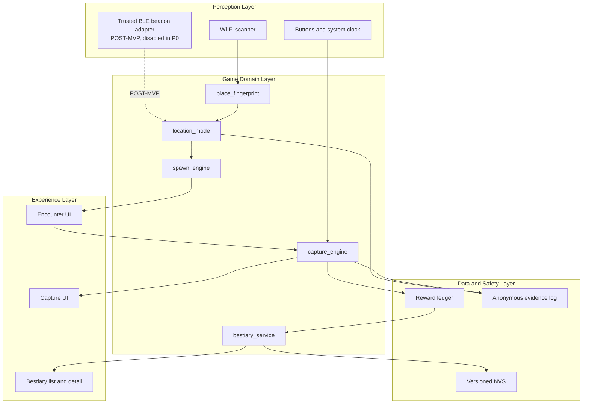
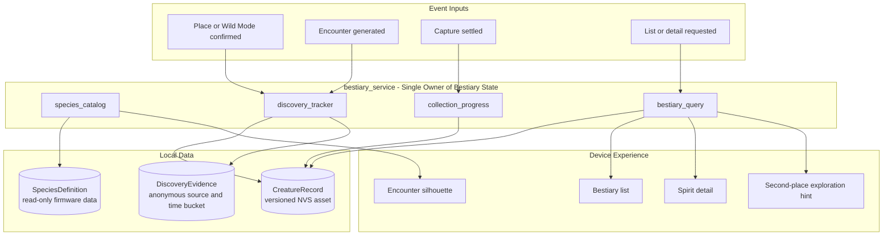
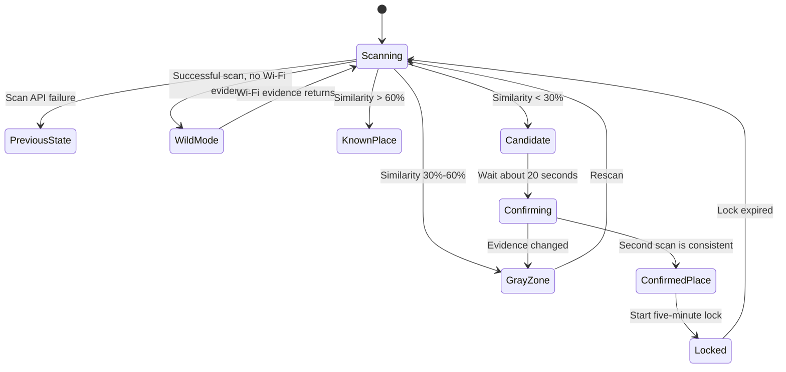

# City Spirits Passport

An offline-first city exploration game for AI Passport.

> **Project goal:** Build a playable device prototype in four weeks. A player
> visits a place, encounters an original spirit, completes a 10-20 second
> capture interaction, and stores the result in a local bestiary.

## Scope Labels

- **[MVP]** Required for the first external product test.
- **[POST-MVP]** Consider only after MVP success metrics are met.
- **OUT OF MVP** Explicitly excluded from the first release.

## 1. Product Vision

City Spirits Passport gives people a reason to carry a small dedicated device
instead of opening another mobile game. Real movement changes the available
game content, while discoveries and captured spirits remain on the device.

The first version answers one product question:

> Is "visit a different place and discover a different small creature" strong
> enough to make people carry the device again?

### Target Users

- People who already enjoy carrying an AI Passport.
- Players who like collecting, light exploration, and low-pressure games.
- The first test group is 10-15 people who did not participate in development.

### Product Principles

1. **[MVP] Validate carrying motivation first.**
   The key behavior is voluntarily visiting a second place.
2. **[MVP] Be honest about location confidence.**
   If the device has insufficient place evidence, it enters Wild Mode instead
   of pretending to know an exact location.
3. **[MVP] Keep interactions short but meaningfully different.**
   A capture lasts 10-20 seconds, and each of the first three spirits uses a
   different rhythm or timing window.
4. **[MVP] Never damage player assets.**
   Scan errors, duplicate events, restarts, and storage failures must not delete
   spirits or grant duplicate rewards.
5. **[MVP] Keep the core loop offline.**
   The game must not depend on a phone, cloud service, account, GPS, or LLM.

## 2. Core Gameplay Loop



### First-Session Experience

1. **[MVP] Visit a place.** The device determines whether the surrounding
   wireless environment is meaningfully different from the previous place.
2. **[MVP] Meet a spirit.** One of three original spirits appears.
3. **[MVP] Capture it.** Press OK at the right moment.
4. **[MVP] Open the bestiary.** The captured spirit remains after restart.
5. **[MVP] Visit another place.** A different environment may produce a
   different encounter.

The first complete experience should take less than three minutes without
verbal instructions.

## 3. Reused Foundation

The project should reuse the proven foundation from Bubu Passport instead of
building a new engine.

| Existing capability | Use in City Spirits Passport |
|---|---|
| Place fingerprinting | Detect meaningful environmental changes |
| Pixel UI and buttons | Encounter, capture, result, and bestiary screens |
| Growth and local save | Preserve captured spirits and progression |
| Host and device tests | Prevent location jitter, save loss, and duplicate rewards |

## 4. MVP Definition

> **[MVP] Definition:** Within four weeks, deliver an offline device prototype
> that can be tested by 10-15 external users and provides enough evidence to
> make a continue, adjust, or stop decision.

### Required MVP Capabilities

| Capability | **[MVP] Required behavior** | Acceptance criteria |
|---|---|---|
| Place recognition | Wi-Fi fingerprinting, confidence gray zone, repeated confirmation, five-minute lock | At most one false new place in 30 scans at the same cafe; at least 9/10 cross-building moves detected within 60 seconds |
| Wild Mode | Separate spirit pool, 30-minute reward cooldown, no place-count increase | Empty scans and scan API failures never create a place or duplicate a reward |
| Spirit content | Three original spirits with names, personalities, silhouettes, and two basic visual states | Unknown, discovered, and captured states are visually distinct |
| Spawn and capture | Deterministic spawn selection and three capture rhythms | Each round lasts 10-20 seconds; fixed seeds reproduce tests |
| Bestiary and save | Three discovery states, list, detail, capture count, companion value, versioned persistence | State remains correct after restart; failed writes never display false success; browsing works offline |
| Evidence collection | Anonymous counters and exportable test traces | First capture, second-place travel, and next-day carry metrics can be calculated |

### OUT OF MVP

- Trusted BLE event beacon deployment.
- Player trading or free-form social features.
- Cooperative capture.
- Leaderboards.
- Maps, GPS, and camera AR.
- Cloud accounts and cloud synchronization.
- Payments or an in-game economy.
- AI-generated field notes.
- Voice summoning.

An interface for trusted BLE beacons may be reserved, but it must remain
disabled in P0.

## 5. System Architecture

The MVP uses an offline-first, event-driven architecture. Perception, place
classification, spawning, capture, bestiary updates, and persistence all run
on the device.



### Module Responsibilities

| Module | Scope | Inputs and outputs |
|---|---|---|
| `environment_scanner` | **[MVP]** Collect normalized Wi-Fi observations on a controlled schedule | System scan results -> bounded environment sample |
| `place_fingerprint` | **[MVP]** Build salted fingerprints and handle similarity, gray zones, and repeated confirmation | Environment sample -> known place, new-place candidate, or no evidence |
| `location_mode` | **[MVP]** Route between known-place and Wild Mode; reserve event-mode interface | Evidence and cooldown -> mode, region ID, confidence |
| `spawn_engine` | **[MVP]** Select deterministic encounters from place or Wild pools | Mode, history, seed -> encounter |
| `capture_engine` | **[MVP]** Run the 10-20 second capture state machine | Button events and seed -> captured, escaped, or failed |
| `bestiary_service` | **[MVP]** Own species data, discovery transitions, collection progress, and read models | Encounter and reward events -> versioned assets and `BestiaryViewModel` |
| `game_ui` | **[MVP]** Render environment, encounter, capture, result, and bestiary screens | Domain state -> visuals and user intents |
| `evidence_log` | **[MVP]** Store anonymous counters, error reasons, and test traces | Domain events -> privacy-safe evidence |

## 6. Bestiary Capability Mapping

The project borrows the product loop of a monster encyclopedia:
**scan -> identify -> record -> query**. It does not copy Pokemon names,
creature designs, visual assets, interface layouts, or fictional settings.

The bestiary is not a secondary menu. It is the asset system that turns a
short capture interaction into long-term collection value and another reason
to leave home.

| Encyclopedia capability | City Spirits mapping | Technical implementation |
|---|---|---|
| Scan and identify | Trigger an original spirit encounter from a confirmed place or Wild Mode; do not identify real animals or people | `environment_scanner` + `location_mode` + `spawn_engine` |
| Species information | Show name, silhouette, personality, habitat preference, and unlocked description | `species_catalog` reads firmware-owned `SpeciesDefinition` data |
| Discovery record | Maintain unknown, discovered, and captured states | `discovery_tracker` updates `CreatureRecord` |
| Capture and growth | Record capture count, recent encounter, and companion value | `collection_progress` consumes idempotent `RewardLedger` events |
| Query and navigation | Show list, detail, collection completion, and coarse exploration hints | `bestiary_query` builds read-only view models for `game_ui` |

### Bestiary Domain Architecture



### Bestiary Write Contract

**[MVP]** `capture_engine` must not directly mutate UI bestiary state.

1. Settle the encounter exactly once.
2. Persist the result in `RewardLedger`.
3. Let `bestiary_service` apply the state transition.
4. Persist the versioned `CreatureRecord`.
5. Display "Captured" only after persistence succeeds.

This prevents false success after power loss, duplicate events, or page
transitions.

### Bestiary Read Contract

**[MVP]** `game_ui` consumes an immutable `BestiaryViewModel` from
`bestiary_query`. It does not read NVS directly. Static species definitions and
player-owned records remain separate so that new content cannot corrupt
existing saves.

## 7. Place and Wild Mode Rules

### Place Definition

A place is a stable wireless environment region, not a chair, room, or precise
coordinate.

| Scenario | **[MVP] Decision** |
|---|---|
| Moving seats inside one cafe | Usually the same place |
| Moving rooms on the same floor | New place only when the difference is stable and significant |
| Moving to another building | Expected to become a new place |

Initial similarity thresholds:

- Above 60%: known place.
- 30%-60%: observation gray zone; no reward.
- Below 30%: new-place candidate.
- Confirm a new place only after two consistent scans about 20 seconds apart.
- Lock the confirmed place for five minutes.

Thresholds are starting values and must be calibrated with device evidence.

### Wild Mode

**[MVP]** A successful scan with no usable Wi-Fi evidence enters Wild Mode.
A scan API failure is not evidence and must keep the previous state.

| Rule | **[MVP] Behavior** |
|---|---|
| Place count | Wild Mode never increments visited-place count |
| Spirit pool | Use a dedicated Wild spirit pool |
| Reward cooldown | At most one settled Wild encounter every 30 minutes |
| Network recovery | Exit Wild Mode and restart place confirmation |
| Scan API error | Keep the previous state; do not spawn or reward |
| Public BLE devices | Never use them as place evidence |

Only a project-defined and verifiable fixed BLE beacon may become place
evidence in a later phase.

### Location State Machine



## 8. Core Data Model

| Object | Key fields | **[MVP] Constraints** |
|---|---|---|
| `PlaceProfile` | local ID, salted fingerprint digest, confidence, last confirmation, schema version | Never persist raw SSID or BSSID; maximum 16 places |
| `Encounter` | encounter ID, region type, spirit ID, random seed, status | Settle each encounter at most once |
| `SpeciesDefinition` | species ID, name, visual asset IDs, personality, habitat tags | Read-only firmware content; no player state |
| `CreatureRecord` | species ID, discovery state, capture count, companion value, recent encounter | Versioned persistence; migrations must preserve assets |
| `DiscoveryEvidence` | species ID, anonymous source type, time bucket | No raw network identifiers or precise location |
| `RewardLedger` | encounter ID, result, time bucket, checksum | Persist before showing success; idempotency source |
| `ExperimentCounters` | starts, first captures, second places, Wild encounters, errors | Anonymous counters only |

## 9. Reliability, Privacy, and Safety

- **[MVP]** Wi-Fi credentials remain in RAM only.
- **[MVP]** Game progress may use versioned NVS.
- **[MVP]** Raw SSIDs, BSSIDs, and public BLE addresses must never be persisted
  or included in test traces.
- **[MVP]** Every reward is protected by a unique encounter ID and the reward
  ledger.
- **[MVP]** Gray-zone location evidence produces no reward.
- **[MVP]** Storage failure displays a failure state instead of false success.
- **[MVP]** Spawn and capture randomness accepts injectable seeds for
  deterministic Host tests.

## 10. Test Strategy

| Layer | **[MVP] Coverage** | Pass condition |
|---|---|---|
| Host unit tests | Fingerprint similarity, mode state machine, spawn generation, capture settlement, reward idempotency, save migration | Core logic runs without hardware and reproduces fixed seeds |
| Component tests | Scan inputs, NVS failures, button events, UI state mapping | Invalid inputs cannot reward, loop forever, or damage saves |
| Device tests | Same-place jitter, cross-building movement, no Wi-Fi, restart recovery, continuous play | Place accuracy thresholds pass; no crash during 30-minute run |
| Product tests | First capture, second-place travel, and next-day carry for 10-15 external testers | Produce a continue, adjust, or stop decision |

## 11. Four-Week MVP Schedule

No post-MVP feature may reduce the W4 external testing window.

| Week | **[MVP] Goal** | Work | Exit condition |
|---|---|---|---|
| W1 | Environment and mode foundation | Extract place engine; implement known place, gray zone, Wild Mode, and Host tests | Stable distinction between same place, another building, no evidence, and scan failure |
| W2 | First playable loop | Define three spirits; implement spawn engine, capture state machine, encounter UI, and result UI | Environment change through capture result works end to end |
| W3 | Save and reliability | Implement bestiary, reward ledger, versioned NVS, final pixel assets, Wild Mode tests, and restart tests | No save loss or duplicate reward; 30-minute device run passes |
| W4 | Product validation | Test with 10-15 external users and collect three core metrics | Make an explicit continue, adjust once, or stop decision |

## 12. Roadmap

| Phase | Entry condition | Scope |
|---|---|---|
| **P0 - MVP** | Start now | Three spirits, Wi-Fi places, Wild Mode, capture, bestiary, local save, evidence traces |
| **P1 - Content expansion** | All P0 product metrics meet continuation thresholds | About ten spirits, companion growth, stronger place ecology, content tooling |
| **P2 - Real-world social play** | P1 proves repeated carrying behavior | Cooperative BLE capture, trusted event beacons, limited events; no free trading |
| **P3 - Optional online services** | Real demand appears from events or content operations | User-authorized coarse phone location, cloud events, AI journey notes |

P1-P3 are not commitments. If P0 fails its decision gate, adding more spirits,
social systems, or cloud services must not be used to hide weak carrying
motivation.

## 13. Friend-Assignable Task List

| ID | Task | Schedule | Definition of done | Good fit | Owner |
|---|---|---|---|---|---|
| 01 | Design three original spirits | W2 | Each has a name, sketch, and one-sentence personality | Illustration, writing | Unclaimed |
| 02 | Create pixel art | W2-W3 | Each spirit has idle and appearance visuals | Pixel art | Unclaimed |
| 03 | Trigger spirits by place | W1 | Two meaningfully different places produce different spirit tendencies | Embedded development | Unclaimed |
| 04 | Build the capture mini-game | W2 | OK input produces captured or escaped result within 20 seconds | Game logic, programming | Unclaimed |
| 05 | Build the small bestiary | W3 | Three discovery states, list and detail work; captured spirits survive restart | UI, programming | Unclaimed |
| 06 | Run external playtests | W4 | Test 10-15 non-developers and record the three product metrics | Any contributor | Unclaimed |
| 07 | Implement Wild Mode | W1 | Successful scan with no Wi-Fi or trusted landmark enters Wild Mode; no place increment; separate pool; one reward per 30 minutes; recovery restarts place confirmation | Embedded systems, state machines | Unclaimed |
| 08 | Verify Wild Mode | W3 | Cover empty successful scan, scan API failure, prolonged no-Wi-Fi state, cooldown, restart, and recovery; no false place, duplicate reward, or asset loss | Testing, reliability | Unclaimed |

Tasks 07 and 08 should preferably be owned by different people so the
implementation and verification are independently checked.

## 14. Product Success Metrics

Recruit 10-15 testers who did not participate in development.

| Metric | Definition | Continue threshold |
|---|---|---|
| First-capture completion | Complete a capture within three minutes without verbal help | At least 8/10 |
| Voluntary second-place travel | Within three days, carry the device to another building or clearly different area to look for spirits | At least 4/10 |
| Next-day carry | Carry or start the device the next day without a developer reminder | At least 3/10 |

The metrics measure different risks:

- First capture: can people understand and operate the product?
- Second place: does location-dependent content create action?
- Next-day carry: does the experience survive beyond novelty?

## 15. Decision Gate

| Decision | Evidence | Next action |
|---|---|---|
| Continue | All three product metrics meet thresholds and place recognition meets technical thresholds | Expand content, then test BLE cooperation |
| Adjust once | First capture is below 8/10, or only one retention metric misses | Fix only onboarding, capture feedback, or reward clarity; rerun one equal-size test |
| Stop or reposition | First capture is smooth, but second-place travel and next-day carry are both 1/10 or lower | Stop adding spirits and social features; reconsider the product direction |

Feature completion only means the experiment can begin. The project is worth
continuing only if players voluntarily visit a second place and carry the
device again the next day.

## 16. Definition of Done

The MVP is complete when all five conditions are true:

1. The device reliably distinguishes at least two places.
2. Three original spirits are available.
3. A player can complete one capture within 20 seconds.
4. Captured spirits appear in the bestiary and survive restart.
5. A person unfamiliar with the project can complete the loop within three
   minutes.

## Development

The W1 hardware-independent domain foundation lives in
`components/city_domain`. It provides keyed Wi-Fi fingerprinting, place
classification, the location-mode state machine, versioned place-profile
encoding, and the Wild Mode reward cooldown.

Run the Host test suite:

```sh
./tools/test-host.sh
```

See [W1 Environment Foundation](docs/architecture/w1-environment-foundation.md)
for data-flow, persistence, and integration contracts.

Install the current firmware on another compatible AI Passport with the
[Device Installation Guide](docs/device-installation-guide.md).

The production integration work for real Wi-Fi place recognition is specified
in the [T08 Real Place Integration Plan](docs/architecture/t08-real-place-integration.md).

The three-species encounter model, individual attributes, place weights, and
schema-v4 migration are described in the
[T09 Three-Species Encounter Design](docs/architecture/t09-three-species-encounters.md).

### Charmander capture MVP

The first playable vertical slice now covers:

1. confirm a place;
2. encounter Charmander;
3. throw a ball in a timing window;
4. persist and open the bestiary entry.

Run the browser acceptance simulator:

```sh
python3 -m http.server 4173 --directory demo
```

Then open `http://127.0.0.1:4173`. See
[Charmander Capture MVP](docs/architecture/charmander-capture-mvp.md) for the
domain state machine and firmware integration boundary.

## References

- Original Chinese proposal:
  <https://my.feishu.cn/wiki/XSr5wfrmxiy1bskO2UDcB6lnnxg>
- Existing foundation:
  <https://github.com/chenjie1129/MayDayFansInTraePassport>

## Encounter eligibility and firmware identity

Current-scan evidence now controls encounter eligibility independently of the
remembered place. Gray, empty, sparse and failed scans cannot create ordinary
place encounters during the stability lock. Firmware versions include a source
fingerprint and an explicit dirty marker, with matching hash manifests for
device-test packages. See [implementation and test procedure](docs/architecture/encounter-eligibility-and-build-identity.md).

Wild Mode and pocket controls now add a separate sparse-signal encounter pool,
a durable 30-minute opportunity cooldown, Home long-UP screen-off, consumed-button
wake, and asynchronous battery status. See
[behavior, persistence and device checks](docs/architecture/wild-mode-and-pocket-controls.md).

The Home menu also includes **Passport**: anonymous stamps for confirmed saved
places, species collection progress, and a next exploration goal. See
[Passport behavior and verification](docs/architecture/passport-progress.md).
