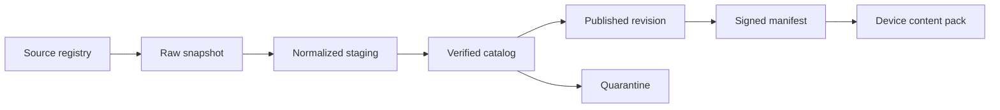

# 图鉴系统全面调研与数据架构设计

状态：研究基线与实施方案
日期：2026-09-15
适用项目：Pokedex for AI Passport

## 1. 决策摘要

图鉴系统不能用一个“总条目数”描述。现实产品至少同时存在物种、形态、地区/
游戏目录、研究任务、发现状态和玩家拥有个体六种不同维度。把这些概念压进一张
表或一个状态枚举，会直接造成重复统计、错误迁移和无法扩展的 API。

本方案作出以下决策：

1. 以稳定的 `CreatureKey` 表示物种/形态身份，以 `CatalogMembership` 表示某
   条目属于哪个地区或游戏图鉴；
2. 内容事实、玩家进度、拥有个体、地点证据和媒体资产分别建模；
3. 官方来源负责权威核验，PokéAPI 等结构化社区源只负责自动采集和变更发现；
4. 数据进入生产前必须经历 raw、normalized、verified、published 四个阶段；
5. “实时刷新”实现为近实时变更发现和受控发布，不允许上游变化直接修改设备
   存档或在未审核时进入固件；
6. 当前 ESP32-C3 继续使用离线编译目录和 NVS。联网采集仅运行在开发/发布
   环境，不进入设备核心循环；
7. 已实现来源注册表、固定提交的数据快照、SHA-256、完整性校验、刷新频率
   控制和增量 diff；
8. 产品门槛通过前不建设账号、云同步、微服务、向量数据库或 LLM 数据加工。

## 2. 调研范围与方法

### 2.1 本报告所称“图鉴”

本报告聚焦 Pokémon 类图鉴系统，并抽象出可用于其他收藏图鉴的通用模型。
不把卡牌卡面、动画剧集、商品 SKU、玩家背包或战斗图鉴直接计入生物图鉴。
这些内容可以通过外部引用关联，但拥有不同的身份和版本体系。

### 2.2 证据等级

| 等级 | 来源 | 可用于 | 不可直接用于 |
|---|---|---|---|
| A | Pokémon 官方 Pokédex、HOME、游戏官网 | 官方名称、编号、类型、产品语义 | 未获许可的批量正文/素材复制 |
| B | PokeAPI 及其固定 Git 提交 | 自动采集、关系映射、差异发现、统计 | 无复核的官方事实发布 |
| C | Bulbapedia、Serebii 等社区资料 | 交叉验证、异常调查 | 单独作为生产权威 |
| D | 项目原创内容与规则 | 本项目描述、遭遇权重、短文案 | 冒充官方设定 |

每个生产字段都必须有 `source_claim`。不能给整个对象只挂一个 `source_url`，
因为名称、类型、描述、游戏属性、图片和叫声可能来自不同来源、不同版本和
不同许可。

### 2.3 调研基线

本次自动快照来自 PokéAPI 数据仓库提交：

```text
4b82c204ddd19ecb8eda2ea044ccb59e222b721c
```

采集时间为 2026-09-15。官方尾项核验为：

```text
National Pokédex #1025 = Pecharunt
```

详细机器快照见
[`content/research/pokedex_source_snapshot.json`](../../content/research/pokedex_source_snapshot.json)。

## 3. 图鉴分类标准

### 3.1 一级分类：按身份粒度

| 类型 | 主键 | 示例 | 是否独立计数 |
|---|---|---|---|
| 物种 Species | `namespace_id + species_id` | Pikachu | 是，National count |
| 形态 Form | `species_key + form_id` | Mega、地区形态、外观形态 | 单独统计，不增加物种数 |
| 变体 Variety | `species_key + variety_id` | 可战斗或数据实现变体 | 数据源口径，不能等同形态 |
| 个体 Instance | `player_id + instance_id` | 玩家捕获的一只 Pikachu | 玩家资产，不属于全局目录数 |
| 媒体 Asset | `sha256` | 图片、叫声、模型 | 按文件/manifest 统计 |

物种、变体和形态的边界在不同游戏与数据源中并不完全一致。必须保存来源口径，
不能把 PokeAPI 的 `pokemon-form` 数量称为“官方形态总数”。

### 3.2 二级分类：按目录范围

| 范围 | 模型 | 特征 |
|---|---|---|
| National | 全局稳定编号 | 一个物种一个 National 编号 |
| Regional | 地区子集和地区顺序 | 同一物种可属于多个地区目录 |
| Game-specific | 某游戏可登记集合 | 可能要求该游戏来源的个体 |
| Expansion/DLC | 主游戏之外的子目录 | 可与主地区重复 |
| Event/Challenge | 活动或专题集合 | 有开始/结束时间和完成规则 |
| User-defined | 玩家收藏夹或过滤器 | 派生视图，不改变权威目录 |

Pokémon HOME 官方说明同时支持 National Pokédex 和 game-specific Pokédex；
后者只登记来自相应游戏的 Pokémon。因此“目录成员资格”和“玩家是否拥有”
必须是两张关系，不能在物种表上放一个 `region` 字段。

### 3.3 三级分类：按收集状态

```text
Discovery: UNKNOWN -> SEEN -> CAPTURED
Ownership: 0..N owned instances
Research:  locked -> active -> complete
Category:  standard / shiny / lucky / mega / gigantamax / ...
```

Pokémon GO 官方帮助确认 seen、caught、unknown 的不同展示，并把 Shiny、
Lucky、Gigantamax 等作为独立分类视图。Pokémon Legends: Arceus 官方说明
单次捕获不足以完成条目，需要重复研究任务。因此：

- `CAPTURED` 不是研究完成；
- 捕获普通形态不等于捕获 Shiny；
- 释放最后一个个体不应擦除历史发现；
- 进化获得和捕获获得必须是不同 acquisition source；
- 分类视图是条件集合，不应复制一份 DexRecord。

### 3.4 四级分类：按内容范围

| 内容域 | 典型字段 | 更新特征 |
|---|---|---|
| 身份 | 编号、稳定 key、名称 | 极低频，必须强治理 |
| 分类 | 类型、世代、目录成员 | 低频、版本相关 |
| 描述 | Pokédex 文案、本地化 | 可按游戏/语言多版本 |
| 游戏规则 | 属性、技能、遭遇规则 | 版本相关，不是普适事实 |
| 媒体 | 图片、模型、叫声 | 大对象、独立许可和版本 |
| 研究 | 任务、计数、解锁事实 | 产品规则，不应写死在物种状态 |
| 玩家状态 | seen/captured/owned | 高频、事务性、私有 |
| 来源 | URL、版本、哈希、许可 | 所有发布字段必须可追溯 |

## 4. 数量规模与统计框架

### 4.1 2026-09-15 快照

| 统计实体 | 数量 | 口径 |
|---|---:|---|
| National species | 1,025 | PokeAPI 结构化数据；官方 #1025 Pecharunt 交叉核验 |
| Pokémon varieties | 1,351 | PokeAPI `pokemon.csv` 数据实现口径 |
| Pokémon forms | 1,579 | PokeAPI `pokemon_forms.csv` 口径 |
| Pokédex scopes | 35 | PokeAPI 目录资源，含 main-series 与非主系列 |
| Generations | 9 | PokeAPI `generation_id` |
| Dex memberships | 8,010 | 物种到各图鉴范围的多对多关系 |
| 当前设备目录 | 15 | 项目 `content/species.json` |

重要解释：

- `1,025`、`1,351`、`1,579` 不是三个可相加的 Pokémon 数；
- form 和 variety 是不同层次的实现实体；
- 35 个 dex scope 会重复包含同一物种；
- 8,010 是 membership 行数，不是独立物种数量；
- 当前设备 15 条是产品内容包，不是外部全量目录的镜像。

### 4.2 按世代的新增物种

| 世代 | 新增物种 |
|---|---:|
| I | 151 |
| II | 100 |
| III | 135 |
| IV | 107 |
| V | 156 |
| VI | 72 |
| VII | 88 |
| VIII | 96 |
| IX | 120 |
| 合计 | 1,025 |

同步器校验所有物种恰好属于一个 generation，并验证九代总和等于 National
species 总数。

### 4.3 代表性图鉴范围

| 图鉴范围 | 条目数 | 说明 |
|---|---:|---|
| National | 1,025 | 全局物种编号 |
| Kanto | 151 | 地区目录 |
| original Johto | 251 | 数据源定义的原始 Johto scope |
| Hoenn / updated Hoenn | 202 / 211 | 游戏版本差异 |
| original / extended Sinnoh | 151 / 210 | 游戏版本差异 |
| original / updated Unova | 156 / 301 | 续作扩展 |
| Kalos Central/Coastal/Mountain | 153 / 153 / 151 | 同一地区拆成三个子目录 |
| original / updated Alola | 302 / 403 | 版本扩展 |
| Galar | 400 | 主目录 |
| Isle of Armor / Crown Tundra | 211 / 210 | DLC 子目录 |
| Hisui | 242 | 研究型图鉴 |
| Paldea | 400 | 主目录 |
| Kitakami / Blueberry | 200 / 243 | DLC 子目录 |
| Lumiose City / Hyperspace | 232 / 132 | 当前结构化源中的后续目录 |
| Champions | 231 | 非主系列 scope |

这些数量是固定提交下的 source census。它们不是永恒常量，也不表示每个
目录都使用相同的完成规则。生产系统必须以 `catalog_id + revision` 标识范围。

### 4.4 统计指标定义

必须分别发布：

```text
species_count
form_count
variety_count
catalog_scope_count
catalog_membership_count
published_entry_count
device_installed_entry_count
player_seen_count
player_captured_species_count
player_owned_instance_count
player_research_completed_count
```

禁止使用含糊的 `pokemon_count`。若业务页面必须显示“收集率”，公式必须携带
分母版本：

```text
completion_ratio =
  captured_required_entries(catalog_id, revision) /
  required_entries(catalog_id, revision)
```

不计入完成条件的 Mythical、活动或可选条目必须由 `completion_policy` 明确，
不能通过代码例外散落在 UI。

## 5. 数据来源与治理

### 5.1 来源注册

已实现
[`content/research/pokedex_sources.json`](../../content/research/pokedex_sources.json)，
每个来源登记：

- 来源 ID 和 authority tier；
- URL、Git 仓库和分支；
- 允许访问的 host；
- 可提供的字段范围；
- 刷新频率；
- fair-use 与 license URL；
- 是否允许自动批量采集；
- 官方人工核验的 expected value 和日期。

采集器只能访问 allowlist 中的 HTTPS host，避免配置被篡改后读取任意地址。

### 5.2 字段级溯源模型

完整系统应建立：

```text
SourceClaim
  entity_key
  field_path
  normalized_value_hash
  source_id
  source_revision
  source_url
  observed_at
  verified_at
  verifier
  confidence
  license_status
  review_status
```

同一实体允许多个 claim。例如：

- National ID 和名称由官方页面确认；
- generation、目录 membership 由 PokeAPI 自动采集；
- 项目短描述由内部编辑创作；
- 图片和叫声分别保存独立来源、哈希和许可状态。

### 5.3 冲突处理

| 冲突 | 处理 |
|---|---|
| 官方与结构化源不同 | 阻止发布，人工复核 |
| 两个官方游戏版本不同 | 作为 version-scoped facts 共存 |
| 名称本地化不同 | 按 locale、游戏、revision 保存 |
| form 定义不同 | 保存 source taxonomy，不自动合并 |
| 社区源新增、官方未确认 | 进入 quarantine，不进入生产 |
| 官方删除或改号 | 禁止物理删除稳定 key，标记 RETIRED 并迁移 |
| 素材许可不明 | 元数据可研究，素材禁止打包发布 |

### 5.4 法律与版权

官方站点的事实可用于人工核验，但页面正文、图片、声音和模型受知识产权保护。
官方条款明确要求不能擅自复制或传播其内容。当前工具只保存 URL、核验结果和
聚合统计，不镜像官方正文或媒体。

PokéAPI 仓库提供开源许可和商标声明，但这不自动授予 Pokémon 角色、名称、
图片或声音的商业再分发权。公开发布前必须逐项完成素材许可审计；技术上的可
抓取不等于法律上的可使用。

## 6. 数据采集与验证流水线

### 6.1 四阶段数据区



| 阶段 | 内容 | 可否用于设备 |
|---|---|---|
| Raw | 源响应、commit、ETag、SHA-256 | 否 |
| Normalized | 统一 key、类型和关系 | 否 |
| Verified | 字段 claim、冲突已解决、许可已确认 | 候选 |
| Published | 不可变 revision、签名 manifest | 是 |
| Quarantine | 缺失、冲突、未来版本、许可未知 | 否 |

### 6.2 已实现的采集器

[`tools/sync_pokedex_research.py`](../../tools/sync_pokedex_research.py)
实现以下能力：

1. `git ls-remote` 解析 PokéAPI 数据仓库最新 commit；
2. 按 commit 哈希下载五张 CSV，而不是使用会漂移的 branch 内容；
3. 三路并发，有界 60 秒超时和最多三次指数退避；
4. 单响应最大 16 MiB，避免异常源耗尽内存；
5. 对每张 CSV 记录 byte length、ETag 和 SHA-256；
6. 生成 generations、Pokédex scopes 和 membership 聚合；
7. 验证 official tail 与结构化源末项一致；
8. 计算与时间无关的 `data_sha256`；
9. 生成 added/removed/changed Pokédex diff；
10. 通过临时文件和 `os.replace` 原子更新快照；
11. `--check` 完全离线，不让 CI 依赖互联网；
12. 校验当前 `content/species.json` 的 ID 在已核验 National 范围内。

运行：

```sh
python3 tools/sync_pokedex_research.py --refresh
python3 tools/sync_pokedex_research.py --refresh --force
python3 tools/sync_pokedex_research.py --check
```

### 6.3 完整性规则

当前自动规则：

- species ID 从 1 连续到 National 总数；
- species 名称和 ID 唯一；
- National entry number 连续；
- National number 与 species ID 一致；
- generation 分区完整、不重不漏；
- generation 数量之和等于 National 总数；
- pokemon variety 引用有效 species；
- form 引用有效 pokemon；
- Pokédex 名称唯一；
- 每个 Pokédex 内 entry number 唯一；
- National 末项与官方核验一致；
- 快照 `data_sha256` 可重算；
- 本地产品目录 ID 唯一且在官方编号范围内。

生产导入还必须增加：

- 必填字段覆盖率；
- 类型、进化和 form 外键；
- evolution cycle 检测；
- locale 覆盖；
- 描述长度和禁用控制字符；
- 图片尺寸、格式、alpha、解码和 hash；
- 音频采样率、时长、非静音和 hash；
- encounter pool 非空且权重无溢出；
- 旧 revision key 不被重用；
- license status 为 approved。

## 7. 实时刷新与增量更新

### 7.1 对“实时”的判断

权威 Pokédex 内容不是每秒变化的数据。对官方站点做秒级轮询既浪费资源，也
可能违反服务条款。合理目标是：

| 数据 | 发现频率 | 发布时限 |
|---|---:|---:|
| 上游 Git 数据 commit | 每 24 小时 | 发现后进入 review |
| 官方新作/新物种公告 | 发布窗口每 1–6 小时人工检查 | 核验后 24–72 小时 |
| 内部编辑内容 | Git webhook 即时 | CI 通过后发布 |
| 素材安全/版权撤回 | 事件触发 | 1 小时内冻结/回滚 |
| 设备内容包检查 | 用户主动或每天一次 | 不影响离线核心 |
| 玩家本地进度 | 操作时立即本地提交 | 可选云同步最终一致 |

因此本方案提供“近实时变更发现 + 受控发布”，而不是“上游一变，设备立即
信任并展示”。

### 7.2 更新状态机

```text
IDLE
  -> CHECK_INTERVAL
  -> RESOLVE_UPSTREAM_REVISION
  -> UNCHANGED
  -> FETCH_PINNED_FILES
  -> VALIDATE_SCHEMA
  -> COMPUTE_DIFF
  -> QUARANTINE | REVIEW_REQUIRED
  -> VERIFIED
  -> BUILD_SIGNED_REVISION
  -> CANARY
  -> PUBLISHED | ROLLED_BACK
```

任何失败都保留上一个 `PUBLISHED` revision。不能清空当前目录，也不能让半
完成的下载或索引构建对用户可见。

### 7.3 增量模型

每个实体计算稳定哈希：

```text
entity_hash = SHA256(
  stable_key +
  canonical_normalized_fields +
  source_revision
)
```

两个 revision 之间生成：

```text
ChangeSet
  base_revision
  target_revision
  added_keys[]
  updated_keys[]
  retired_keys[]
  unchanged_count
  source_diffs[]
  validation_report
```

不使用 destructive delete。上游消失的 key 进入 `retired_pending_review`，
人工确认后才发布 RETIRED。设备 delta package 携带 base/target revision、
chunk hash 和签名；base 不匹配时下载完整包，不能盲目应用增量。

### 7.4 缓存与同步

开发/服务端：

- Git commit 是源版本；
- raw response 按 commit 永久缓存；
- normalized entity 按 content hash 去重；
- Redis key 包含 published revision；
- CDN URL 使用 asset SHA-256；
- 新 revision 使用新 key，不做大规模 purge。

设备端：

- RAM 只保留当前 4 行和当前详情；
- Flash 只保留 active pack、rollback pack 和有界 LRU；
- manifest 下载到临时区域，完整校验后原子切换；
- 网络失败继续使用 active pack；
- 内容包永远不能直接修改玩家 NVS；
- 原始 Wi-Fi/BLE 标识不进入同步 payload。

## 8. 完整技术架构

### 8.1 数据层

#### 当前阶段

| 存储 | 技术 | 数据 |
|---|---|---|
| Git | JSON、生成 C 文件 | 15 条生产内容、来源 |
| NVS | versioned binary + CRC32 | 玩家进度、个体、地点、设置 |
| Flash app | const C arrays | 图片、叫声、字体 |
| Research snapshot | JSON + SHA-256 | 外部源统计和变更证据 |

#### 产品门槛后

| 存储 | 技术选型 | 责任 |
|---|---|---|
| Metadata OLTP | PostgreSQL | catalog、entry、membership、revision、claim |
| Asset store | S3/TOS compatible object storage | immutable image/audio/package |
| Cache | Redis | 热门详情、revision、计数 |
| Search | OpenSearch/Elasticsearch | 可重建全文和筛选索引 |
| Event log | Kafka/Pulsar 或托管队列 | 发布和索引事件 |
| Analytics | ClickHouse/warehouse | 行为统计，不访问生产主库 |

PostgreSQL 不保存大媒体；OpenSearch 不是权威库；Redis 丢失后必须可回源；
分析库不能参与捕获事务。

### 8.2 服务层

```text
Source Ingest Service
  -> 拉取固定 revision、保存 raw hash、生成 SourceClaim

Validation Service
  -> schema、引用、内容、许可和冲突检查

Catalog Service
  -> revision 内一致的详情和游标列表

Package Service
  -> 为设备生成签名 full/delta content pack

Asset Service
  -> manifest 和对象存储签名 URL

Search Service
  -> 名称、编号、类型、目录范围过滤

Progress Sync Service (optional)
  -> 幂等同步玩家进度，不处理地点原始证据

Publish Orchestrator
  -> review、canary、发布、回滚、outbox
```

早期先实现为模块化单体。只有 Catalog、Asset、Search、Progress 出现独立扩容
或故障隔离需求时才拆微服务。提前微服务化会增加部署、消息一致性和排障成本，
对 P0 ROI 为负。

### 8.3 应用层

设备应用新增抽象：

```c
typedef struct {
    uint64_t namespace_id;
    uint64_t species_id;
    uint32_t form_id;
} city_creature_key_t;

typedef struct {
    bool (*get_entry)(city_creature_key_t key,
                      city_catalog_entry_t *out,
                      void *context);
    bool (*list_page)(const city_catalog_cursor_t *cursor,
                      city_catalog_page_t *out,
                      void *context);
    bool (*open_asset)(const city_asset_ref_t *asset,
                       city_asset_reader_t *out,
                       void *context);
} city_catalog_provider_t;
```

实现两个 provider：

1. `compiled_catalog_provider`：当前默认，完全离线；
2. `content_pack_provider`：读取已验证的外部内容包。

`city_domain` 只消费 provider 输出，不能执行 HTTP、解析远程 JSON 或持有
凭据。下载、解包、Flash IO 在 worker 中完成，不能阻塞 LVGL。

### 8.4 前端展示层

240×320 三键界面必须保持有界渲染：

- 列表只创建 4 个可见 row；
- 用 cursor/window 读取，不把全目录加载到 RAM；
- UNKNOWN、SEEN、CAPTURED、RESEARCHED 和 category badge 分层显示；
- 详情按 tab/page 分块，不在一屏堆积全部事实；
- 搜索只在有键盘/手机端提供；设备端使用分类、编号和最近项；
- 动态文案必须有固定高度、wrap 和最长语言渲染 fixture；
- 资源缺失显示明确 unavailable，不显示错误物种图片；
- content revision、source status 和离线状态用于诊断，不暴露原始地点证据。

对于当前设备，新增复杂搜索框是伪需求。三键输入下，地区/类型过滤、最近访问
和分页比自由文本搜索更快、更可靠。

## 9. 数据模型

```text
Catalog
  catalog_id
  scope_type
  game_version
  published_revision
  completion_policy_id

Creature
  namespace_id
  species_id
  canonical_name_key
  introduced_generation
  status

Form
  creature_key
  form_id
  form_kind
  is_default
  battle_only

CatalogMembership
  catalog_id
  catalog_revision
  creature_key
  local_number
  required_for_completion

LocalizedText
  content_key
  locale
  text_kind
  value
  source_claim_id

AssetManifest
  manifest_id
  creature_key
  asset_kind
  byte_length
  sha256
  license_status

DexRecord
  player_id/device_profile
  creature_key
  discovery_state
  acquisition_mask
  encounter_count
  capture_count

OwnedCreature
  instance_id
  creature_key
  stats
  hp
  anonymous_origin_place_id

ResearchRecord
  creature_key
  task_id
  progress
  completed
```

`CatalogMembership` 解决一个物种属于多个地区/游戏图鉴的问题；`Form` 解决
形态不增加 National species 数的问题；`ResearchRecord` 避免把研究完成错误
建模成 discovery 的第四状态。

## 10. API 规范

### 10.1 目录列表

```http
GET /v1/catalogs/{catalog_id}/entries
  ?revision={revision}
  &locale=zh-CN
  &limit=20
  &cursor={opaque_cursor}
  &type=water
```

响应：

```json
{
  "catalog_id": "national",
  "revision": "2026-09-15.1",
  "items": [
    {
      "key": {"namespace_id": 1, "species_id": 25, "form_id": 0},
      "catalog_number": 25,
      "name": "皮卡丘",
      "types": ["electric"],
      "content_hash": "sha256:..."
    }
  ],
  "next_cursor": "...",
  "etag": "sha256:..."
}
```

约束：

- `limit` 默认 20、最大 100；
- cursor 绑定 catalog、revision、locale 和 filter；
- 禁止深分页 `OFFSET`；
- revision 不存在返回 `UNSUPPORTED_REVISION`；
- 未声明的过滤条件返回 400，不允许任意 SQL 字段查询。

### 10.2 条目详情

```http
GET /v1/catalogs/{catalog_id}/entries/{namespace_id}:{species_id}:{form_id}
If-None-Match: "sha256:..."
```

响应只返回请求 locale 和当前产品需要的字段。图片、叫声返回 asset manifest，
不内嵌 base64。

### 10.3 增量更新

```http
GET /v1/catalogs/{catalog_id}/changes
  ?from_revision={base}
  &to_revision={target}
  &cursor={cursor}
```

```json
{
  "base_revision": "2026-09-14.1",
  "target_revision": "2026-09-15.1",
  "added": [],
  "updated": [],
  "retired": [],
  "next_cursor": null,
  "manifest_sha256": "...",
  "signature": "..."
}
```

### 10.4 玩家同步

```http
POST /v1/players/{player_id}/devices/{device_id}:sync
Idempotency-Key: {device_id}:{device_sequence}
```

同一个 key 和 payload 重试必须返回第一次的结果；同 key 不同 payload 必须
返回 `IDEMPOTENCY_CONFLICT`。服务端不能接收原始 SSID、BSSID、精确位置、
设备备份或 Wi-Fi 凭据。

## 11. 一致性、高可用与容错

| 操作 | 一致性 | 失败行为 |
|---|---|---|
| 本地捕获 | NVS 强一致 | commit 失败不显示奖励 |
| 内容发布 | manifest revision 强一致 | 旧 revision 继续服务 |
| 内容读取 | revision 内一致 | stale cache 可读 |
| 搜索 | 最终一致 | 退化为编号/目录浏览 |
| 玩家云同步 | 单 player shard 强一致 | 本地排队、幂等重试 |
| 分析 | 最终一致 | 不影响业务 |

服务端发布采用 transaction + outbox：

```text
metadata transaction
  -> outbox event
  -> package builder
  -> search indexer
  -> CDN manifest
```

对象和索引全部准备完成后才切换 published revision。搜索失败不回滚权威元数据，
但新 revision 保持不可见，直到 read model 完整。

高可用最低配置：

- 两个无状态 API 实例；
- PostgreSQL 主库 + 同区只读副本 + PITR；
- Redis 可丢失重建；
- 对象存储版本化和跨区复制；
- 队列至少一次投递，消费者幂等；
- 每季度恢复演练；
- 设备始终保留一个已验证 active pack。

## 12. 性能与容量指标

### 12.1 当前设备

| 指标 | 门槛 |
|---|---:|
| 本地列表 page | 4 条 |
| 本地查询 P95 | < 50 ms |
| Flash asset 打开 P95 | < 100 ms |
| 内容包切换 | 完整校验后一次原子切换 |
| 最小 free heap | 不低于当前发布基线，需真机记录 |
| factory 余量 | >= 256 KiB |
| NVS 可见结果 | durable commit 之后 |

### 12.2 后端阶段

| 阶段 | 目录规模 | 读吞吐目标 | P95 | 可用性 |
|---|---:|---:|---:|---:|
| 模块化单体 | 1M | 1,000 RPS | < 300 ms | 99.9% |
| 水平扩展 | 100M | 10,000 RPS | < 300 ms cached | 99.95% |
| 分片/多区域 | 1B+ | 按 shard 线性扩展 | 区域内 < 300 ms | 99.99% core |

指标是进入压测的验收目标，不是架构图自动带来的结果。

### 12.3 数据质量 SLO

| 指标 | 目标 |
|---|---:|
| stable key 唯一性 | 100% |
| 外键完整性 | 100% |
| 必填字段完整率 | 100% |
| shipped 字段来源覆盖 | 100% |
| shipped 素材 license approved | 100% |
| 支持语言覆盖 | 100% |
| 未解决 Tier A/Tier B 冲突 | 0 |
| 错误自动发布 | 0 |
| 上游 commit 发现延迟 | <= 24 h |
| 审核后包生成 | P95 <= 30 min |
| 搜索 revision 落后 | P95 <= 5 min |

## 13. 验证方法

### 13.1 当前已实现验证

```sh
python3 tools/sync_pokedex_research.py --check
python3 tests/test_pokedex_research_sync.py
./tools/test-host.sh
```

自动测试覆盖：

- source host allowlist；
- CSV schema 和 ID 引用；
- National 连续性；
- generation 完整分区；
- official tail 一致；
- snapshot hash 防篡改；
- source registry 版本绑定；
- refresh interval；
- added/removed/changed diff；
- 本地 15 条生产目录 ID 边界。

### 13.2 规模测试

生成 10K、1M、100M、1B 四档 synthetic catalog，分别验证：

- keyset pagination 不重复、不漏项；
- 100% hash 重算一致；
- 增量包大小与改动数量线性相关；
- 搜索索引可从 published revision 重建；
- 热 key、冷 cache、CDN miss 和数据库回源；
- 单 shard、Redis、队列和对象存储故障；
- 旧设备读取新 manifest 时正确拒绝或降级；
- 设备只创建 4 个 row，RAM 不随目录总数线性增长。

API 压测记录 p50/p95/p99、error rate、CPU、RSS、DB pool、IOPS、cache hit、
replication lag、queue lag 和单位百万请求成本。没有完整负载模型和故障注入，
不能宣称“支持一亿条”。

### 13.3 设备验证

Host 测试不能替代：

- ESP-IDF firmware build；
- 3 MiB factory size check；
- 240×320 中英文 render；
- 内容包损坏和断电切换；
- NVS 满、写失败、commit 成功响应丢失；
- Wi-Fi 扫描期间最小 heap 和最大 DMA block；
- 实体按键、音频和两小时携带测试。

## 14. 分阶段实施建议

### 立即执行

1. 将当前调研快照加入 CI 的离线 `--check`；
2. 修复 15 -> 16 的稳定 ID 存档迁移；
3. 提取 `city_catalog_provider_t`，默认仍用编译目录；
4. 给 `content/species.json` 增加字段级 source claim；
5. 建立内容候选与生产目录的人工审批边界；
6. 继续以 16 条作为当前固件安全发布上限。

### 产品门槛通过后

1. 签名内容包和设备 A/B manifest；
2. 构建期生成 compact index、locale chunk 和 asset manifest；
3. 静态对象存储 + CDN，无账号也可下载公开内容包；
4. 只有出现跨设备进度需求时才增加 Progress Sync；
5. 单体实际达到 CPU/IO/SLO 阈值后再水平扩展；
6. 只有模块需要独立发布和故障隔离时才拆微服务。

### 明确不做

- P0 引入账号和云数据库；
- 设备直接解析第三方 JSON；
- 实时下载 encounter 图片；
- 将官方页面全文和素材批量镜像；
- 用 LLM 自动生成“官方事实”；
- 用向量数据库替代稳定 ID、关系表和全文索引；
- 让上游变更自动越过人工审核发布到设备；
- 把 raw SSID/BSSID 或精确位置上传为“数据完善”。

## 15. 商业判断

图鉴数量本身不是护城河。把 15 条扩到 1,025 条会显著增加素材、版权、编辑、
QA 和分发成本，却不必然提升第二地点探索率或次日携带率。真正可验证的价值是：

- 新地点是否带来有意义的新发现；
- 用户是否主动再次打开图鉴；
- 内容更新是否提高回访，而不是只提高下载量；
- 每个新增内容包的制作成本是否低于其留存增益。

因此架构应允许规模增长，但投入顺序必须由产品指标触发。当前最优策略仍是：

```text
先证明小目录的携带价值
  -> 再证明内容包更新能提升回访
  -> 再建设目录服务
  -> 最后根据真实负载做水平扩展和微服务
```

## 16. 来源

- [官方 Pokémon Pokédex：#1025 Pecharunt](https://sg.portal-pokemon.com/play/pokedex/1025/)
- [Pokémon HOME Features](https://home.pokemon.com/en-us/features/)
- [Pokémon Legends: Arceus Gameplay](https://legends.arceus.pokemon.com/en-us/gameplay/)
- [Pokémon GO: Viewing the Pokédex](https://niantic.helpshift.com/hc/en/6-pokemon-go/faq/124-viewing-the-pokedex/)
- [PokéAPI v2 Documentation](https://pokeapi.co/docs/v2)
- [PokéAPI source repository](https://github.com/PokeAPI/pokeapi)
- [PokéAPI license](https://github.com/PokeAPI/pokeapi/blob/master/LICENSE.md)
- [Pokémon Terms of Use](https://www.pokemon.com/us/legal/terms-of-use)

第三方地区图鉴数量仅用于交叉调查；本报告提交的统计值来自固定 PokéAPI
commit，并由 hash 和不变量验证，不依赖未固定的网页正文。
