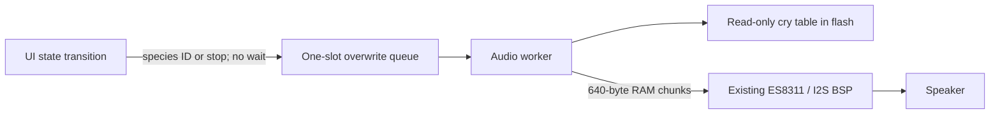

# Species cries and Pokédex descriptions

## User behavior

Entering an encounter after discovery is saved plays that species' cry once,
for both place encounters and sparse-signal Wild Mode. Selecting CATCH/RUN
rebuilds the encounter screen without restarting audio. Entering an unlocked
Pokédex detail from the list also plays its cry. Unknown entries stay locked.
Leaving either screen cancels the sound; returning from an action does not
automatically replay it. Audio does not alter capture timing or persistence.

## Ownership and execution

`main/pokemon_audio.c` owns one FreeRTOS worker with a 4 KiB stack and one
two-byte request slot. Only this worker initializes, configures, writes to,
or changes the volume of the codec. `components/bsp` retains hardware
ownership; game rules and the save schema contain no audio state.

Requests copy the species ID rather than retaining pointers into mutable UI
or bestiary state. Queue overwrite implements latest-request-wins; ID zero
cancels. The worker checks for replacement before each 20 ms PCM write and
mutes interrupted playback before clearing the DMA tail. There is no
unbounded backlog, runtime download, decoder allocation or whole-clip RAM
copy. A single 640-byte stack buffer stages PCM from mapped flash. The
existing full-duplex BSP additionally allocates its codec and TX/RX DMA
resources; those are separate from the worker stack and must be considered
in the device heap budget.

Successful playback drains 120 ms of silence (longer than the six 240-frame
DMA buffers) before muting, preserving the final samples. Cancellation is
observed at chunk boundaries; replacement may wait for this silent drain.
The 20 ms interval is a nominal scheduling bound, not a hard real-time
guarantee under I2S or scheduler failure. Volume and mute follow the saved Settings preferences (60 percent and unmuted by default). The worker rechecks the effective volume between PCM chunks; muting or setting volume to zero cancels pending playback.
The codec stays configured and muted when idle; this implementation does
not claim a measured idle-power or battery-life improvement.

Worker allocation failure leaves gameplay available. Codec initialization
failure disables playback for the boot instead of retrying partially
allocated hardware resources. A write error mutes the output and ends the
clip. Unknown species IDs produce silence, never an arbitrary fallback cry.
The UI never waits for success or completion. ESP-IDF driver timeouts can
block this worker, but audio does not hold the LVGL lock.

## Content and resource contracts

Each of the 15 existing standard-form species has an ID-keyed asset. See
[source and conversion provenance](../../content/cries/SOURCES.md).
The generated table occupies 426,000 bytes of PCM plus small index overhead
in flash. The generator caps audio at 700,000 bytes and clips at four seconds;
the ESP-IDF image-size check additionally enforces the 3 MiB factory app
partition. Audio never writes to NVS, Card ID, Recovery or the partition
table. Never flash the full app into the smaller Recovery partition.

Pokédex descriptions and dual types were rechecked against all 15 official
Singapore Pokédex pages linked from `content/species.json`. Existing authored
facts remain accurate for the depicted standard forms. They wrap in a
220-by-48-pixel area at 14 px font size; seen, caught and evolved states are
covered by production LVGL fixture renders. No content or save migration was
needed for this task.

## Validation layers

- Host suite: real generated assets, byte-for-byte PCM writes for all species,
  unknown IDs, nonblocking submission, latest request selection, stop before
  playback, mid-clip cancellation/replacement, allocation/init/write failures.
- Asset check: ID/name coverage and source/PCM hashes, generated-table freshness.
- Production LVGL render harness: 221 fixtures including all descriptions,
  with text width/height and screen bounds checks plus visual inspection.
- Firmware: ESP32-C3 image build and factory-partition size check.
- Device diagnostic: `CITY_AUDIO_RENDER_SMOKE=ON` pauses game timers, omits
  input registration and cycles all 15 encounter/detail pairs without saving.
  Duplicate encounter renders must yield exactly one cry. Serial receipts
  must show 30 completed clips, 15 details and return Home without panic.
- Installation: back up flash first, write only the factory app, restore a
  normal build with both diagnostic flags OFF, compare app readback and
  protected partitions, verify normal boot and display/button readiness.

Serial completion proves codec writes and UI execution, not subjective
speaker quality. Physical listening remains a separate acceptance check.
