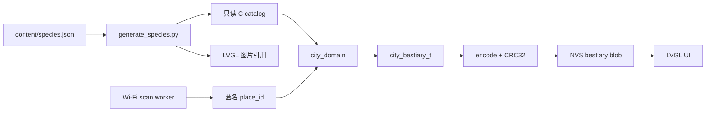

# 宝可梦图鉴扩展技术评估报告

状态：新增图鉴功能的开发前评估
日期：2026-09-15
目标分支：`feat/pokemon-pokedex`

## 1. 结论摘要

本报告评估的是在现有 AI Passport 固件架构中继续增加宝可梦图鉴条目，不改变
硬件、不调整分区、不引入云端服务，并继续保留离线捕捉、地点识别、叫声和现有
存档可靠性约束的情况下，系统能支持多大的图鉴。

### 结论

| 指标 | 结论 | 说明 |
|---|---:|---|
| 当前图鉴条目 | 15 | `content/species.json`、生成 C 表和 UI 已保持一致 |
| 推荐的安全上限 | **16 条总条目** | 在当前资源策略下，最多新增 1 条，仍保留至少 256 KiB 的固件余量目标 |
| 当前分区下的算术上限 | 19 条左右 | 按平均图片和叫声大小计算，只是“能塞进镜像”的数字，不是可发布上限 |
| 生成器声明上限 | 32 条 | `tools/generate_species.py` 的校验上限，尚未通过 32 条真实固件、渲染、NVS 和真机测试 |
| NVS 物种记录容量 | 至少 32 条的量级 | 不是当前主要瓶颈；当前解码器仍需先解决新增 ID 的迁移兼容 |
| 玩家拥有的个体 | 160 个 | `CITY_MAX_OWNED_POKEMON`，与物种条目数独立 |
| 已保存地点 | 16 个 | `CITY_PLACE_MAX_COUNT`，不是图鉴条目容量 |
| 外部 API / 数据库 | 当前不需要 | 核心流程是本地 C API、编译进固件的内容和 NVS 存档 |

因此，对“最多能够支持添加的宝可梦数据条目数量”的直接回答是：

> **以当前图片、叫声、UI 和分区策略为前提，当前 15 条目最多安全新增 1
> 条，建议把 16 条总条目作为本分支的发布上限。**

这不是说 17 或 19 条必然无法编译，而是说它们会侵蚀稳定性余量，必须先改变
素材压缩、分区或存档架构，并完成重新测量后才能承诺。

## 2. 评估边界与证据状态

### 2.1 产品和隐私边界

仓库规则要求 P0 的核心循环离线运行，不依赖手机、账号、GPS、云服务或 LLM。
因此本次容量评估不把服务器数据库、远程图片下载或云端 API 当作解决方案。

原始 SSID、BSSID、公共 BLE 地址、凭据和精确位置不能进入持久化或证据日志。
地点系统只允许把匿名 `place_id` 传给遭遇和图鉴域逻辑；原始无线数据在扫描
工作任务中使用后清零。

### 2.2 当前工作树注意事项

本分支从提交 `06ee899` 创建。工作区在评估和验证期间已有与本报告无关的
未提交变更（最终范围以 `git status` 为准），包括：

- `main/main.c`
- `tests/passport_render/harness.c`
- `tools/build_identity.py`
- `VERSION`
- `docs/architecture/cloud-buddy-dialogue.md`
- `docs/architecture/pokedex-data-system.md`

这些变更不是本报告引入的内容，报告没有覆盖、回滚或重写它们。已有
`build/firmware/Pokedex-AI-Passport.bin` 的构建时间为 2026-09-15 14:04，内嵌
身份仍指向 `7295c0d` 的脏构建，因此它只能作为当前固件资源基线，不能替代
本分支新增内容后的正式固件验证。

## 3. 当前架构



实际职责边界如下：

| 层 | 当前实现 | 图鉴扩展时的要求 |
|---|---|---|
| 内容 | `content/species.json`，构建期生成 C 表 | 继续编译进固件；运行时不解析 JSON |
| 领域 | `components/city_domain` | 只处理稳定 ID、状态、遭遇和存档模型 |
| 硬件 | `components/bsp` | 只负责 NVS、屏幕、音频和扫描适配 |
| UI | `main/main.c` + LVGL | 只读取领域输出；不能直接修改持久化模型 |
| 存档 | NVS checksummed blob | 写入、commit、读回校验成功后才能展示结果 |
| 扫描 | `place_scan_coordinator` worker | 不能阻塞 LVGL；扫描失败、空扫描和有效证据必须区分 |

这个分层适合扩展图鉴。当前主要风险不在是否需要数据库，而在固件镜像、
资源素材、存档迁移和真机余量。

## 4. 数据模型与存档评估

### 4.1 内容目录

`content/species.json` 是内容源，当前有 15 个条目。`tools/generate_species.py`
会生成：

- `components/city_domain/include/species_catalog.h`
- `components/city_domain/src/species_catalog.inc`
- `main/assets/species_images.inc`
- 需要图片时生成 `main/assets/roster_sprites.c/.h`

当前生成器有 `3 <= len(rows) <= 32` 的构建期限制，并要求前 3 个稳定 ID 为
`1、4、7`。这个 32 只是工具约束，不是经过资源预算和真机压力测试后的产品
容量。添加条目仍需同时补齐：

- 稳定 `species_id`
- 名称、类型、短描述和游戏属性
- 遭遇池和 Wild 资格
- 图片资源
- 可选但当前体验已使用的离线叫声
- 中英文 UI 文案
- 内容来源和素材许可记录

运行时不能按 JSON、文件名或数组位置推断身份。持久化含义必须是稳定 ID，
数组重排不能改变旧存档。

### 4.2 玩家存档

当前 `city_bestiary_t` 把物种级图鉴记录和个体级拥有记录分开：

- `city_creature_record_t`：发现状态、捕获次数、最后地点、最新/最佳属性、
  友情、进化和当前 HP。
- `city_owned_pokemon_t`：个体 ID、物种 ID、来源地点、个体属性、当前 HP、
  性格、友情和最多 5 条有界回忆。

这是正确的建模方向。不能因为 `capture_count > 0` 就推导全部所有权，因为
进化和未来其他获得方式可以产生没有捕捉记录的个体；释放最后一个个体也不应
抹掉历史图鉴记录。

当前 wire 格式为：

```text
header                  48 bytes
species record           22 bytes each
owned record             32 bytes each
CRC32                    4 bytes
owned capacity           160 records
```

公式为：

```text
CITY_BESTIARY_ENCODED_BYTES
  = 48 + CITY_SPECIES_COUNT * 22 + 160 * 32 + 4
```

所以：

| 物种数 | 固定 wire blob | 相对当前 |
|---:|---:|---:|
| 15 | 5,502 bytes | 当前实际值 |
| 16 | 5,524 bytes | +22 bytes |
| 24 | 5,700 bytes | +198 bytes |
| 32 | 5,876 bytes | +374 bytes |

当前主机编译下，`sizeof(city_bestiary_t)` 为 5,576 bytes。即使把物种数提高到
32，按当前字段布局推算也约为 6.1 KiB。物种记录扩展对 RAM 的影响很小；真正
占用大头的是固定的 160 个个体槽位以及事务复制。

### 4.3 NVS 分区

`partitions.csv` 固定了：

| 分区 | 起始地址 | 大小 | 作用 |
|---|---:|---:|---|
| `nvs` | `0x9000` | 24 KiB | 设置、地点身份/目录和玩家图鉴 |
| `factory` | `0x10000` | 3 MiB | 正常应用 |
| `cardid` | `0x356000` | 16 KiB | AI Passport 身份，不能改作图鉴空间 |
| `recovery` | `0x700000` | 1 MiB | Recovery，必须保留 |

最大地点目录 wire 大小为：

```text
8 + 16 * 112 + 4 = 1,804 bytes
```

在 32 物种、160 个体的情况下，图鉴 blob 为 5,876 bytes。把最大地点目录、
16-byte 设备私钥和 12-byte 设置 blob 一起估算，已知业务 payload 约为
7,708 bytes；即便暂时按图鉴和地点各保留一份旧/新 payload，仍约为 15,388
bytes，低于 24 KiB 分区。

但是这些数字没有包含 NVS entry metadata、分片、旧页回收、其他系统 key 和
断电时的垃圾回收余量。因此不能仅凭 payload 宣布 NVS 已通过容量测试。必须
在真实 ESP32-C3 上用已有地点数据填满分区，并反复写入图鉴直到发生页面回收，
记录：

- `nvs_set_blob`、`nvs_commit` 和读回的耗时；
- 可用 entry 数和 `ESP_ERR_NVS_PAGE_FULL` 等错误；
- 断电/重启后的旧新代际选择；
- 最大连续写入次数和最小 heap；
- 图鉴与地点同时写入时是否互相影响。

### 4.4 新增物种的迁移阻塞点

当前 `city_bestiary` 解码器对当前版本要求：

- wire 中的物种数量必须等于当前编译时的 `CITY_SPECIES_COUNT`；
- blob 长度必须等于当前数量对应的固定长度；
- 每个记录必须在当前编译目录中找到。

因此，直接把 15 增加到 16 后，旧的 schema-12 blob 不会自然变成一个带新
UNKNOWN 记录的合法 blob。只增加 `CITY_CATALOG_VERSION` 也不够，因为当前
解码分支没有按旧数量读取并按稳定 ID 补齐新记录。

正式实现必须二选一：

1. 新增 save schema，读取旧 schema 后按稳定 ID 映射、补 UNKNOWN、重新编码、
   commit、读回并校验；或
2. 先把解码器改成能按稳定 ID 兼容缺失记录，同时明确 catalog 兼容策略。

推荐第一种，原因是当前项目已经有版本化迁移、CRC、失败不发布和旧 schema
回读验证的约定。迁移失败必须阻止图鉴结果发布，不能回退到损坏或过期旧数据。

## 5. API 与处理容量

### 5.1 没有需要扩容的网络 API

当前核心没有 REST、RPC、云数据库或网络图鉴接口。图鉴使用的是本地 C API：

- `city_species_definition`
- `city_species_id_at`
- `city_species_index`
- `city_bestiary_record`
- `city_bestiary_encounter_status`
- `city_bestiary_capture_personality`
- `city_bestiary_encode/decode`
- `city_bestiary_owned_at`
- `city_bestiary_owned_by_id`

所以“API 接口容量”在本项目中的含义是数组边界、索引宽度、调用复杂度和异步
队列容量，而不是服务器 QPS。

### 5.2 域 API 的容量边界

| API/模块 | 当前边界 | 32 条时的判断 |
|---|---|---|
| 物种生成器 | 1–32 条 | 类型宽度和生成器可接受，但未完成全链路验证 |
| `city_species_id_at` | `uint8_t` index | 32 条安全；不应把数组 index 持久化 |
| 物种查找 | 线性遍历 | 15 到 32 的最坏查找仍可忽略 |
| 遭遇选择 | 遍历全部物种，临时 `weights[]` | 32 条安全；总权重应继续用宽整数 |
| 图鉴列表 | 4 个可见 LVGL row，分页 | 维持分页后 UI 内存近似 O(4) |
| 拥有个体查询 | 最多扫描 160 个个体 | 当前已经存在，物种数增加不改变上限 |
| `city_bestiary_is_valid` | 物种检查 + 个体 ID 去重，个体部分 O(160²) | 物种从 15 到 32 只增加常数项 |
| 地点匹配 | 最多 16 个地点、每个最多 12 个 token | 与图鉴物种数独立 |
| Wi-Fi 原始扫描 | `BSP_WIFI_SCAN_MAX = 16` | 与图鉴物种数独立 |

当前 160 个体的重复 ID 校验最多约 12,720 次比较，远低于一次扫描和一次
NVS 写入的时间成本。无需因为增加十几个物种就引入哈希表、数据库或 LLM。
只有未来把物种扩展到数百条并且引入复杂筛选时，才值得重新评估索引结构；
在当前硬件上，素材和闪存比 CPU 查找更先成为瓶颈。

### 5.3 异步任务和队列

当前运行时是串行且有界的：

| 能力 | 当前容量/资源 | 影响 |
|---|---|---|
| 地点扫描命令队列 | 1 个命令 | 同时只允许一次扫描 |
| 地点扫描结果队列 | 2 个结果 | 支持候选确认过程，不支持无界积压 |
| 图鉴写入 | `s_save_in_progress` 单飞 | 一次只处理一项图鉴事务 |
| 设置写入 | 1 个请求、1 个结果 | 与图鉴使用不同 namespace |
| 音频请求 | 1 个请求 | 新叫声请求覆盖旧请求 |
| Wi-Fi 扫描 | worker 中阻塞约 2–4 秒 | 不能放进 LVGL 或按键回调 |

增加物种不会提升并发 API 容量，也不应该通过增加队列深度来解决。核心交互
是单设备、单用户、单次探索；无界队列会增加 RAM、延迟和存档竞态，收益很低。

## 6. 固件 Flash 预算

### 6.1 当前可用空间

已有构建产物的 app bin 为 2,772,048 bytes，factory 分区为 3,145,728 bytes：

```text
factory headroom = 3,145,728 - 2,772,048
                 = 373,680 bytes
```

当前镜像已经使用约 88.1% 的 factory 分区。保留 256 KiB 发布余量后，真正
可用于新内容、代码和元数据的增长空间只有：

```text
373,680 - 262,144 = 111,536 bytes
```

这也是本评估把“安全新增 1 条”与“算术上还能塞更多”分开的原因。

### 6.2 图片成本

当前每个新物种使用一张 110×110 大图和一张 82×82 小图，格式为
RGB565A8。生成的有效图像数据为：

```text
110 * 110 * 3 + 82 * 82 * 3 = 56,472 bytes / species
```

这些数组是 `const` 数据，主要驻留在 Flash，不会把所有图片预加载到 RAM。C
源文件中的十六进制文本大小不能直接当作最终 Flash 成本；应以实际链接后的
bin 和 map 文件为准。

### 6.3 叫声成本

当前 15 个条目的离线 PCM 叫声合计 426,000 bytes，单条范围为 11,890–44,054
bytes，平均 28,400 bytes。`tools/generate_cries.py` 还设置了 700,000 bytes
的全部叫声预算。

如果每个新条目继续带图片和平均叫声，第一阶成本约为：

```text
56,472 + 28,400 = 84,872 bytes / species
```

基于已有 app bin 的一阶估算如下。估算未包含新增 UI 文案、编译器对齐、素材
描述符、代码变更和链接差异，不能替代实际 build。

| 总条目 | 新增条目 | 估算新增 Flash | 估算 app 大小 | 分区剩余 | 判断 |
|---:|---:|---:|---:|---:|---|
| 15 | 0 | 0 | 2,772,048 | 373,680 | 当前基线 |
| 16 | 1 | 84,872 | 2,856,920 | 288,808 | 仍高于 256 KiB 目标，需实测 |
| 17 | 2 | 169,744 | 2,941,792 | 203,936 | 低于发布余量，不建议 |
| 18 | 3 | 254,616 | 3,026,664 | 119,064 | 稳定性余量不足 |
| 19 | 4 | 339,488 | 3,111,536 | 34,192 | 算术上可装，不能发布 |
| 20 | 5 | 424,360 | 3,196,408 | -50,680 | 超出 factory 分区 |

若新增条目不带叫声，只计算图片，算术上约可到 21 条；这不是当前产品体验
的支持上限，因为叫声是现有图鉴行为的一部分，且新增文案、迁移和 UI 代码
仍需占用空间。

## 7. RAM、LVGL 和渲染性能

### 7.1 当前硬件约束

- ESP32-C3，无 PSRAM。
- 8 MiB 总 Flash，但 app 只有 3 MiB。
- LVGL 内存池为 24 KiB。
- ST7789 屏幕为 240×320。
- LVGL 使用 240×20 的单 DMA buffer：
  `240 * 20 * 2 = 9,600 bytes`。
- `double_buffer = false`，避免挤压内部 DMA RAM。

### 7.2 图鉴列表

当前图鉴列表每次只创建 4 行，按页显示，不会为所有物种创建 LVGL 对象。
只要继续保持这个策略，物种从 15 增加到 16 或 32，不会线性增加屏幕对象、
绘制缓冲或 LVGL heap。

需要重点检查的不是数量本身，而是边界内容：

- 最长英文名称、中文名称和编号组合是否截断；
- 最长类型文本是否越过 220 px 内容区；
- 描述是否在固定的 220×48 区域内完整换行；
- UNKNOWN、SEEN、CAPTURED、EVOLVED 四种状态是否仍能区分；
- 页尾 Back 行是否始终可达；
- 中英文字体是否包含新增名称所需字符；
- 从最后一页、唤醒和长按返回时是否产生越界索引。

`tests/passport_render` 已经提供屏幕边界、裁剪、隐藏省略号和文字重叠检查，
新增条目必须把最长内容纳入真实 LVGL render fixture，而不是只在 Host 上验证
字符串长度。

### 7.3 保存和扫描任务

当前关键任务栈：

| 任务 | 栈配置 |
|---|---:|
| `place_scan` | 6,144 bytes |
| `bestiary_write` | 16,384 bytes |
| `settings` | 3,072 bytes |
| `battery` | 3,072 bytes |
| `pokemon_audio` | 4,096 bytes |

图鉴写入任务需要复制整个 `city_bestiary_t`，并在 BSP 适配器中临时分配编码
buffer。当前 schema-12 的迁移读回路径还会同时持有模型、期望编码和实际编码
等临时数据，因此不能只看 5,502-byte wire blob 就判断 RAM 足够。

增加到 32 个物种时，物种记录只让模型增加约 0.5 KiB、wire 增加 374 bytes；
这一增量本身可控。但任何新增研究字段、表单、个体属性或无限历史都会直接
乘以 160 个体或破坏固定内存预算，不能和“新增几个图鉴条目”混在同一改动中。

## 8. 稳定性和实现风险

### 高风险

1. **新增条目破坏旧存档读取。** 当前解码器按当前物种数检查固定长度，必须
   做 schema migration 或兼容解码。
2. **素材挤压 factory 分区。** 当前仅剩 373,680 bytes；达到 17 条时已经
   低于 256 KiB 余量目标。
3. **把 32 当作产品上限。** 生成器上限没有设备级证据，尤其没有 32 条素材
   的实际链接、渲染、NVS 和连续操作数据。
4. **把现有脏构建当作本分支验证。** 既有 bin 的 source identity 不是本分支
   新内容后的身份，必须重新构建。

### 中风险

1. **UI 文案增长。** 物种名称、类型和描述在中英文下都要经过 240×320 渲染
   检查；仅测 ASCII 字节数不够。
2. **素材来源和授权。** `artwork` URL 或 cry URL 不是自动获得再分发授权；
   每个新资源都要补来源和许可记录。
3. **NVS 磨损与提交延迟。** 每次捕获会重写完整图鉴 blob；物种记录本身增量小，
   但个体固定 160 槽使每次写入仍是整块事务。
4. **内容和遭遇池不一致。** 增加 `CITY_SPECIES_COUNT` 不能替代权重、Wild
   资格、进化目标和所有 ID 映射的校验。

### 低风险

- 15 到 32 条的线性 ID 查找；
- 32 条以内的权重数组；
- 4 行分页列表的 LVGL 对象数量；
- 物种记录对 NVS payload 的 22-byte/条增量。

## 9. 推荐实现方案

### 阶段 A：先做架构兼容

1. 保持 `species_id` 为唯一持久化身份，禁止用数组 index。
2. 将物种记录数量、asset 引用、UI 列表和遭遇选择全部继续由同一份
   `content/species.json` 生成。
3. 增加严格的内容校验：重复 ID、缺失素材、无效进化目标、空遭遇池、超出
   编码范围和不允许的移除都要在构建期失败。
4. 新增 save schema 或实现稳定 ID 的旧 blob 映射，覆盖 15 -> 16 的旧存档
   迁移、CRC、断电、读回和未来 schema 拒绝。
5. 保留当前 4 行分页，不做全量列表、搜索框或运行时 JSON。

### 阶段 B：只新增一个条目

先把总条目从 15 增加到 16，完成一条完整的素材和存档闭环。该阶段才是当前
分支能够在不改分区的情况下合理承诺的范围。不要在同一阶段顺手加入表单、
研究任务、云同步、交易、战斗或无限历史。

### 阶段 C：发布门槛

必须同时满足：

- Host 测试通过：`./tools/test-host.sh`；
- `python3 tools/generate_species.py --check` 通过；
- 真实 16 条目 firmware build 通过；
- app bin 不超过 `0x300000`；
- 保留至少 256 KiB factory 余量，或由产品负责人明确批准新的余量标准；
- 真实 LVGL fixture 覆盖 0/1/15/16 条目、最长名称、最长描述、最后一页和
  中英文；
- NVS 已有地点数据时，图鉴迁移、重复捕获、释放、重启和写入失败均不丢数据；
- 真实设备记录最小 heap、最大内部/DMA 连续块、写入延迟和按键响应；
- 固件构建、真机测试与 Host 测试分开报告，不能用 Host 通过冒充硬件验证。

只有在上述证据完成后，才能讨论 17–24 条。若确实需要继续扩展，优先顺序
应是：

1. 采用更小的 Flash 资源格式并对代表性图片做 LVGL 解码 benchmark；
2. 评估是否可以把叫声做成独立、可选但仍离线可用的资源包；
3. 重新测量链接后的 app、DMA heap、渲染延迟和音频任务；
4. 仅在实测证据支持时，才调整 256 KiB 余量或分区布局。

不建议通过增加云端数据库来绕过本地限制。服务器不能增加 ESP32-C3 的 Flash
和 RAM，运行时下载还会破坏离线核心循环，并引入凭据、缓存、版本一致性和
隐私风险。

## 10. 最终判定

### 当前版本可以承诺的范围

- 物种图鉴：15 条现状，**最多新增 1 条，目标总数 16 条**；
- 玩家拥有个体：最多 160 个；
- 地点目录：最多 16 个；
- 内容：编译进固件，离线可用；
- 存档：一个带版本和 CRC 的 NVS 事务 blob；
- UI：240×320，4 行分页；
- API：本地、单设备、单飞异步任务，不需要 SQL 或网络服务。

### 不能直接承诺的范围

- 17 条以上的稳定发布；
- 24 条或 32 条的真机支持；
- 不做存档迁移就新增物种；
- 用网络 API 替代本地资源；
- 把 `CITY_SPECIES_COUNT <= 32` 当成容量证明。

这份报告给出的 16 条是当前架构下的保守发布上限，不是最终产品内容上限。
如果 P0 携带和回访验证通过，下一轮应先用真实资源和真实设备重新测量，再决定
是否值得投入素材压缩和分区级扩展。
