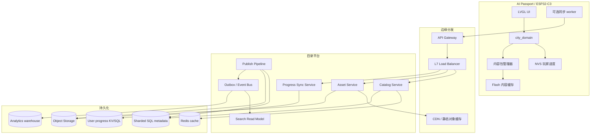
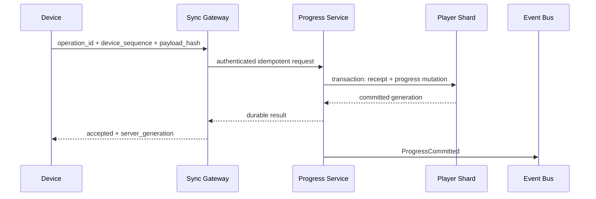

# 宝可梦图鉴“理论无上限”可扩展架构方案

状态：架构设计提案，未授权直接引入云端或微服务
日期：2026-09-15
基线：ESP32-C3 AI Passport、8 MiB Flash、无 PSRAM、240×320 LVGL
关联评估：[当前图鉴容量评估](pokemon-pokedex-capacity-assessment.md)

## 1. 先定义“理论无上限”

物理上不存在真正无限的数据库、带宽或存储。这里的“理论无上限”必须定义为：

1. 内容目录不再由 `CITY_SPECIES_COUNT`、C 数组长度或单个 NVS blob 限制；
2. 全量目录可以通过增加分片、对象存储和计算节点继续增长；
3. 单个设备只承载有限的离线内容包、索引和本地进度，不承诺在 8 MiB Flash
   上保存全量目录；
4. API 使用稳定的逻辑 ID、游标和版本，不依赖数组位置，新增条目不需要重写
   全部旧数据；
5. 云端不可用时，设备仍能完成已经安装内容包支持的探索、捕捉、浏览和存档。

因此，最终架构是：

```text
逻辑全量图鉴 = 分片元数据 + 不可变素材对象 + 派生搜索索引
单设备图鉴   = 活跃内容包 + 有界本地缓存 + 本地玩家进度
```

这是一种“全量逻辑无上限、边缘设备有界运行”的架构。若要求设备断网后仍能
浏览任意新条目，则必须提前把对应内容包安装到设备；不能把在线目录的容量
承诺伪装成离线能力。

## 2. 设计原则和产品边界

### 2.1 P0 不直接跳到云端

当前产品的核心问题是玩家是否因为地点相关发现而愿意再次携带设备。账号、
云同步、交易、排行榜、云端搜索和 LLM 对话都不是扩大图鉴数量的必要条件。
在产品门槛通过前，保持：

- 捕捉、浏览和基础进度离线可用；
- 无手机、账号、GPS、云服务和 LLM 依赖；
- 原始 SSID、BSSID、公共 BLE 地址、凭据和精确位置不进入持久化；
- 云端内容故障不能阻断本地已安装内容；
- reward 只有在本地持久化或明确的云端幂等提交成功后才可见。

### 2.2 不用大模型解决目录规模

图鉴目录是结构化内容分发问题，不是自然语言推理问题。LLM 不能解决 Flash、
对象存储、索引、版本迁移、重复提交或跨区域一致性；把 LLM 放进捕捉结算还
会增加延迟、成本、幻觉和离线失败面。搜索、筛选和推荐先用数据库索引、
缓存和确定性规则，后续有明确产品证据时再单独评估模型能力。

### 2.3 四类数据必须分开

| 数据 | 权威来源 | 一致性要求 | 是否可缓存 |
|---|---|---|---|
| 内容目录 | 内容发布服务和不可变版本 | 发布版本强一致 | 可长期缓存 |
| 图片、叫声和字体包 | 对象存储 | 内容哈希决定身份 | CDN 和设备可缓存 |
| 玩家图鉴和个体 | 设备 NVS；未来可选用户分片库 | 单用户提交强一致、读模型可最终一致 | 可短暂缓存 |
| 地点证据 | 设备本地匿名地点目录 | 本地事务一致 | 不得把原始无线数据缓存到云端 |

不要把四类数据塞进同一张“万能 Pokémon 表”。目录内容不可变、玩家状态可
变、地点数据有隐私边界，生命周期和故障处理完全不同。

## 3. 目标逻辑架构



关键判断：设备端不应直接访问数据库或对象存储；设备只访问经过版本、认证、
大小限制和降级策略保护的 Gateway/CDN。后端服务不应读取设备原始扫描数据；
同步接口只接收匿名地点 ID、内容 key 和最小业务结果。

## 4. 统一数据模型

### 4.1 稳定内容键

当前 `species_id` 可以作为过渡字段，但“理论无上限”架构必须避免把一个
16-bit ID 当作全局命名空间。建议使用：

```text
CreatureKey
  namespace_id       uint64   内容命名空间或发行方
  entry_id           uint64   稳定物种/生物 ID
  form_id            uint32   标准形态为 0
```

逻辑主键是 `(namespace_id, entry_id, form_id)`，不是 display order、数组 index、
文件名或数据库自增 ID。`uint64` 不是说一定会用满，而是避免未来迁移时再次
受限于 15、32 或 65,535 个条目。

### 4.2 不可变目录模型

```text
Catalog
  catalog_id
  owner_namespace
  published_revision
  default_locale
  status                 DRAFT | PUBLISHED | RETIRED

CatalogEntry
  namespace_id
  entry_id
  form_id
  display_order          presentation only
  content_revision
  name_key
  description_key
  type_keys[]
  gameplay_class
  base_stats
  encounter_policy_id
  asset_manifest_id
  evolution_family_id

AssetManifest
  asset_manifest_id
  content_revision
  asset_type             SPRITE | CRY | FONT | DATA
  byte_length
  sha256
  media_type
  object_uri
  min_runtime_version
```

发布后 `CatalogEntry` 和 `AssetManifest` 不原地修改。修正文案、素材或属性会
生成新 `content_revision`；旧 revision 保留到所有支持窗口结束。这样可以：

- 使用 `ETag` 和内容哈希做永久缓存；
- 让设备在旧版本上继续运行；
- 让玩家进度引用明确的内容版本；
- 在发布错误时回滚 manifest，而不是猜测部分更新是否成功。

### 4.3 玩家进度模型

保留当前领域层的“物种记录”和“拥有个体”分层，服务端同步时也不要合并：

```text
DexRecord
  player_id
  creature_key
  discovery_state
  encounter_count
  capture_count
  acquisition_mask
  latest_stats
  best_stats
  last_place_id          anonymous only
  updated_generation

OwnedCreature
  player_id
  instance_id
  creature_key
  origin_place_id        anonymous only
  stats
  current_hp
  flags
  updated_generation

ProgressOperation
  operation_id           idempotency key
  player_id
  device_id
  device_sequence
  operation_type
  payload_hash
  committed_at
```

`ProgressOperation` 是幂等收据，不是无限事件日志。只保留满足重试判重、审计和
冲突处理所需的有界窗口；长期分析事件写入独立分析系统，不能让主存档随玩家
历史无限增长。

### 4.4 版本兼容

每个内容包和 API 响应携带：

```text
catalog_revision
content_schema_version
save_schema_version
min_reader_version
max_reader_version
manifest_sha256
signature
```

新增字段遵循“先扩展、再使用、最后收缩”的迁移顺序。客户端必须忽略未知
JSON 字段，服务端必须拒绝未知的关键枚举和越界数值。删除一个稳定 ID 只能
做成 RETIRED，不能从历史数据库或受支持的设备存档中物理消失。

## 5. 分阶段演进路线

### 阶段 0：当前嵌入式单体

**适用场景**

- P0 体验验证；
- 无账号、无云端、少量固定内容；
- 当前目标是 15 条目，按已有资源预算安全上限为 16 条总条目。

**技术特点**

- `content/species.json` 在构建时生成 C 表；
- 图片和叫声编译进 Flash；
- `city_bestiary_t` 使用版本化、CRC 校验的 NVS blob；
- `city_domain` 管理规则，`components/bsp` 管理硬件；
- LVGL 只创建 4 行图鉴列表；
- 扫描、音频和 NVS 写入在 worker 中执行。

**目标指标**

这些是阶段目标，不是未经测量的现状承诺：

| 指标 | 阶段 0 目标 |
|---|---:|
| factory app 余量 | >= 256 KiB |
| 图鉴列表可见对象 | <= 4 行 |
| 捕获成功发布 | NVS durable commit 后 |
| Host 测试 | 100% 通过 |
| 设备崩溃 | 0 次 / 30 分钟连续操作 |
| 本地图鉴条目 | 15 当前，16 发布目标 |

**瓶颈**

- 3 MiB factory 分区和 RGB565A8 素材；
- 无 PSRAM；
- 固定 NVS blob 和完整事务复制；
- 当前解码器对物种数量和固定长度的强约束；
- 不能在设备端访问“全量远程目录”。

**升级触发条件**

满足任一条件即可进入阶段 1：

- 内容更新需要频繁重刷固件；
- 图片或叫声新增后无法保持 256 KiB Flash 余量；
- 需要在不改固件的情况下发布新条目；
- 需要在多种内容包之间切换；
- 产品门槛已通过，且用户明确需要更多内容。

### 阶段 1：签名内容包 + 有界本地缓存

**适用场景**

- 内容条目超过设备安全 Flash 上限；
- 仍要求核心离线；
- 暂时不需要用户账号和云端玩家进度。

**核心设计**

将“内容”和“固件”解耦。设备安装一个或多个经过签名的内容包：

```text
content-pack/
  manifest.cbor
  catalog-index.bin
  locale/<locale>.bin
  assets/<sha256>
  pack-signature
```

建议技术选型：

- manifest：CBOR 或固定 little-endian 二进制，不在设备端解析 JSON；
- 校验：SHA-256 内容哈希 + Ed25519/ECDSA 签名；
- 下载：HTTPS/BLE relay 均可，凭据不写入设备持久化；
- 安装：双槽 manifest 或临时分区，校验完整后原子切换；
- 查询：按 `CreatureKey` 的排序索引和 Bloom filter；
- 缓存：Flash 上有界 LRU，RAM 只保留当前页面和少量索引窗口。

设备端抽象为：

```c
typedef struct {
    uint64_t namespace_id;
    uint64_t entry_id;
    uint32_t form_id;
} city_creature_key_t;

typedef struct {
    uint64_t catalog_revision;
    uint64_t content_revision;
    bool (*get_entry)(city_creature_key_t key,
                      city_catalog_entry_t *out,
                      void *context);
    bool (*get_asset)(const city_asset_ref_t *asset,
                      city_asset_reader_t *out,
                      void *context);
} city_catalog_provider_t;
```

`city_domain` 只依赖 provider，不关心内容来自编译表还是内容包。provider
失败时只能返回“内容不可用”，不能伪造捕获或改变存档。

**目标指标**

| 指标 | 阶段 1 目标 |
|---|---:|
| 单设备内容包 | 1–10 个活动包，具体取决于 Flash |
| 单设备可浏览条目 | 由包大小决定，必须有界 |
| 内容包完整性 | 100% manifest、哈希、签名校验 |
| 安装失败 | 保留旧包，可继续离线运行 |
| 内容详情读取 | 缓存命中 P95 < 100 ms；Flash miss P95 < 500 ms |
| UI | 不创建全量列表，只按游标/窗口取 4 行 |

**扩展瓶颈**

- 设备 Flash 仍有限；
- 内容包安装需要临时空间；
- LRU 淘汰会影响离线可用性；
- 内容包和旧存档的兼容矩阵开始增长。

**实施步骤**

1. 把所有持久化引用从数组 index 改为稳定 `CreatureKey`；
2. 增加 manifest、签名、哈希和 `min_runtime_version`；
3. 提取 `city_catalog_provider_t`，保留编译表 provider 作为默认实现；
4. 增加 Flash 内容包 provider 和有界索引；
5. 先下载到临时区域，验证后原子切换 active manifest；
6. 让旧包和旧 NVS 进度在网络、下载和新包校验失败时继续可用；
7. 用 16、100、1,000 条合成目录测试分页、详情和内存峰值。

### 阶段 2：垂直拆分的模块化单体

**适用场景**

- 需要内容后台、发布审核、设备内容包生成和基础同步；
- 预计目录在 10 万至 100 万条；
- 团队还没有足够运维能力承担微服务；
- 读写流量仍能由一个后端应用和一套主数据库承载。

这里的“垂直拆分”是按业务职责拆模块，不是立即拆成独立部署单元：

```text
Modular Monolith
  catalog module       目录和 revision
  asset module         素材 manifest 和签名包
  progress module      玩家同步和幂等收据
  search module        搜索读模型
  publish module       校验、审核和发布
```

**技术选型**

- API：外部 HTTPS REST/JSON；内部先使用进程内接口，必要时使用 gRPC；
- 权威元数据：PostgreSQL 16；
- 素材：S3/TOS 兼容对象存储，不把大图片和音频放进 SQL；
- 缓存：Redis 单实例或主从；
- 静态素材：CDN；
- 异步任务：PostgreSQL outbox + worker，先不引入 Kafka；
- 部署：两个无状态应用实例 + 一个主库 + 一个只读副本。

**目标指标**

| 指标 | 阶段 2 目标 |
|---|---:|
| 逻辑目录 | 1,000,000 条 |
| API 读吞吐 | 1,000 RPS，P95 < 300 ms |
| 条目详情缓存命中 | P95 < 100 ms |
| 条目详情缓存未命中 | P95 < 500 ms |
| 发布到搜索可见 | P95 < 60 s |
| 可用性 | 99.9% 月度 |
| 数据库 RPO/RTO | RPO <= 5 min，RTO <= 30 min |
| 同步重复提交 | 100% 幂等，不产生重复捕获 |

**扩展瓶颈**

- 单 PostgreSQL 主库的写入、索引和 vacuum；
- 一个 Redis 实例的内存和故障域；
- 搜索读模型重建速度；
- 发布任务与 API 共用计算资源；
- 单区域故障。

**升级触发条件**

- 主库 CPU 或 IO 在峰值持续超过 70%；
- API P95 连续 15 分钟超过 300 ms，且缓存命中率无法改善；
- 单库存储达到 60–70%，vacuum 影响在线查询；
- 单区域 RTO 或合规要求不再满足；
- 目录读流量超过单实例和单副本的可验证上限；
- 发布、搜索、同步的故障相互放大。

### 阶段 3：无状态服务水平扩展

**适用场景**

- 目录读流量达到数千至数万 RPS；
- 单体应用 CPU、连接数或发布任务互相争抢；
- 需要不停机扩容和分批发布；
- 数据库仍可通过读副本和分区承载。

**架构**

```text
DNS / Anycast
    -> L7 Load Balancer
        -> API Gateway
            -> Catalog API replicas
            -> Asset API replicas
            -> Progress API replicas
        -> Redis Cluster
        -> PostgreSQL primary/read replicas
```

服务实例必须无状态：

- 不在本地磁盘保存权威数据；
- session 使用短期签名 token 或外部 session store；
- 配置通过版本化配置中心发布；
- 所有写接口要求 `Idempotency-Key`；
- 所有重试带指数退避和上限；
- Gateway 用 circuit breaker 隔离慢依赖；
- 只对 GET 和明确幂等操作自动重试。

**负载均衡策略**

| 流量 | 路由方式 | 目的 |
|---|---|---|
| 目录详情 | 普通 L7 round-robin | 实例无状态，缓存吸收热点 |
| 玩家同步 | 按 `player_id` 的一致性路由或 shard router | 减少跨分片事务 |
| 素材 | CDN edge cache | API 不承载大对象带宽 |
| 发布任务 | 独立 worker queue | 不占用在线 API 线程 |
| 搜索 | 独立 search endpoint | 防止复杂查询拖垮详情 API |

**目标指标**

| 指标 | 阶段 3 目标 |
|---|---:|
| 逻辑目录 | 100,000,000 条 |
| 读吞吐 | 10,000 RPS 起步，按压测线性扩展 |
| API P99 | < 800 ms，非搜索详情 |
| CDN 素材命中率 | >= 95% |
| API 实例 CPU | 峰值目标 < 65% |
| 数据库连接池利用率 | 峰值 < 70% |
| 故障实例摘除 | < 30 s |
| 可用性 | 99.95% 月度 |
| RPO/RTO | RPO <= 1 min，RTO <= 15 min |

**扩展瓶颈**

- 热门条目导致单 key cache stampede；
- Redis 集群热点和故障转移；
- 主库写入与副本延迟；
- 分页排序字段不稳定导致重复/漏项；
- 全量 count、模糊搜索和多条件 join 造成数据库扫描。

### 阶段 4：按领域微服务化和事件驱动

**适用场景**

- 目录、素材、玩家同步、搜索和发布拥有不同的发布节奏；
- 团队需要独立扩缩容和故障隔离；
- 单体模块之间的变更已经形成明确边界；
- 已经有 tracing、schema registry、SLO 和值班能力。

不要以“服务数量”作为目标。只有当阶段 3 的指标和组织需求证明独立部署
有收益，才进入阶段 4。

**服务边界**

| 服务 | 权威数据 | 不负责 |
|---|---|---|
| Catalog Service | 条目元数据、revision、兼容性 | 图片二进制、玩家状态 |
| Asset Service | asset manifest、签名、生命周期 | 图鉴业务规则 |
| Progress Service | 用户图鉴、个体、幂等收据 | 全局目录搜索 |
| Search Service | 搜索索引和排序读模型 | 权威写入 |
| Publish Service | 校验、审核、发布工作流 | 在线请求 |
| Sync Gateway | 设备协议、鉴权、批处理 | 直接改其他服务数据库 |
| Recommendation Service | 派生推荐 | 捕获奖励和权威状态 |

**技术选型**

- 服务间：gRPC/HTTP，公共 API 仍使用版本化 REST；
- 事件：Kafka、Pulsar 或云托管等价物；
- 事件契约：Protobuf/Avro + schema registry；
- 搜索：OpenSearch/Elasticsearch，只保存可重建 read model；
- 分析：ClickHouse、BigQuery 或数据湖，不查询在线主库；
- 可观测性：OpenTelemetry traces、metrics、structured logs；
- 部署：Kubernetes 或等价容器平台，服务独立 HPA。

**事件流**

```text
Catalog DB transaction
    -> outbox row
        -> CDC / publisher
            -> CatalogPublished event
                -> Search indexer
                -> Package builder
                -> CDN invalidation marker
                -> Analytics sink
```

发布服务必须先完成 SQL 元数据和对象存储校验，再发布不可变 manifest。搜索和
推荐是最终一致的派生系统；即使它们延迟或丢失，也不能改变目录权威数据或
玩家捕获结果。

**目标指标**

| 指标 | 阶段 4 目标 |
|---|---:|
| 逻辑目录 | 1,000,000,000 条，按分片继续增加 |
| 详情读 P95 | 缓存命中 < 100 ms，冷读 < 400 ms |
| 搜索 P95 | < 800 ms，限制结果窗口 |
| 发布事件可见 | P95 < 30 s |
| 事件重复处理 | 100% 可安全重放 |
| 服务可用性 | 核心读写 99.95%，搜索 99.9% |
| 跨服务数据丢失 | 0，依赖 outbox 和持久化消息 |
| RPO/RTO | RPO <= 1 min，RTO <= 15 min |

**扩展瓶颈**

- 事件分区 key 不均衡导致消费热点；
- 分布式 tracing 和消息重放成本；
- 跨服务查询被错误实现为同步 fan-out；
- 搜索索引和权威数据的版本漂移；
- 团队缺乏契约测试、回放工具和灾备演练。

### 阶段 5：多区域、分片和联邦目录

**适用场景**

- 全球用户或多区域合规要求；
- 单区域故障不能满足 RTO；
- 单一数据库集群的存储、写入或网络上限成为瓶颈；
- 目录需要多个发行方、社区或租户隔离。

**核心做法**

- 目录按 `namespace_id`、租户或 catalog 分片；
- 玩家进度按 `player_id` 固定到 user shard；
- 每个 shard 有主副本、同区域只读副本和异步灾备副本；
- 静态内容通过内容哈希跨区域复制；
- API Gateway 按用户、目录和区域做路由；
- 跨区域只传播不可变发布事件和可重放同步事件；
- 不做跨区域每次请求的强一致 join；
- 需要强一致的玩家操作固定写入 home region；
- home region 不可用时进入明确的离线设备模式，不伪造云端成功。

**容量模型**

```text
logical_catalog_capacity
  = sum(entry_capacity_of_all_catalog_shards)

online_read_capacity
  = min(
      gateway_capacity,
      api_replica_capacity,
      cache_capacity,
      database_replica_capacity,
      CDN/origin_bandwidth
    )

progress_write_capacity
  = min(
      user_shard_primary_capacity,
      idempotency_store_capacity,
      event_log_capacity
    )
```

“无上限”来自增加 shard，而不是把单个数据库表或单个 Redis key 做大。每个
shard 必须有明确容量阈值、拆分工具和迁移演练；否则只是把单体瓶颈换成了
难以恢复的超大集群。

**目标指标**

| 指标 | 阶段 5 目标 |
|---|---:|
| 目录规模 | 1B+，通过新增分片继续扩展 |
| 区域内详情 P95 | < 300 ms |
| 跨区域只读 P95 | < 800 ms |
| 核心写入可用性 | 99.99% |
| 单区域故障 | 15 分钟内切换或明确降级 |
| 内容资产 | 多区域哈希校验，禁止半包可见 |
| 跨区域一致性 | 内容 revision 最终一致；用户写入按 home region 强一致 |

这些是设计目标。是否达到必须用目标负载、真实数据分布和故障注入验证，
不能从副本数量推导。

## 6. API 设计

### 6.1 公共读取 API

所有列表接口使用游标分页，不允许用 `OFFSET` 作为深页方案：

```http
GET /v1/catalogs/{catalog_id}/entries
    ?revision=2026-09-15
    &cursor=eyJrZXkiOi...
    &limit=50
    &locale=zh-CN
    &type=water
```

约束：

| 参数 | 规则 |
|---|---|
| `limit` | 默认 20，最大 100 |
| `cursor` | opaque、签名、绑定 filter 和 revision |
| `revision` | 缺省使用 published revision，不能静默跨 revision |
| `locale` | 未命中时回退到默认语言，不回退到任意语言 |
| `type` 等过滤 | 只允许有索引的白名单字段 |
| 深分页 | 继续使用 keyset cursor，不扫描前置页 |

详情接口：

```http
GET /v1/catalogs/{catalog_id}/entries/{namespace_id}:{entry_id}:{form_id}
If-None-Match: "sha256:..."
```

批量接口只用于设备预取和内容包构建：

```http
POST /v1/catalogs/{catalog_id}/entries:batchGet
{
  "revision": "...",
  "keys": [
    {"namespace_id": 1, "entry_id": 4, "form_id": 0}
  ]
}
```

批量 key 上限建议 50，响应必须报告缺失 key，不能因为一个坏 key 让整批
悄悄成功。

### 6.2 内容包 API

```http
GET /v1/catalogs/{catalog_id}/manifests/{revision}
GET /v1/catalogs/{catalog_id}/packs/{pack_id}
HEAD /v1/assets/{sha256}
```

manifest 是设备安装的事务边界。设备必须先下载 manifest，再按大小、类型、
哈希和签名验证每个对象，最后切换 active revision。不能在下载半包时把新
物种显示给玩家。

### 6.3 玩家同步 API

同步接口是可选的后 P0 能力，不能成为设备核心捕获的前置依赖：

```http
POST /v1/players/{player_id}/devices/{device_id}:sync
Idempotency-Key: device-7:sequence-981
Content-Type: application/json
```

请求只包含：

- 已安装内容 revision；
- 上次确认的 server cursor；
- 有界的本地操作批次；
- 匿名 `place_id`；
- `device_sequence`、payload hash 和操作类型。

禁止上传原始 SSID/BSSID、精准坐标、完整 NVS、设备身份备份和不必要的日志。

响应必须包含：

```text
accepted_operations[]
rejected_operations[]
conflicts[]
next_cursor
server_generation
required_content_revision
```

重复的 `Idempotency-Key` 必须返回原始业务结果；相同 key 配不同 payload hash
必须拒绝并报警。不能用 HTTP 200 就代表捕获已持久化。

### 6.4 API 错误和限流

统一错误码至少包括：

```text
INVALID_CURSOR
UNSUPPORTED_REVISION
CONTENT_NOT_INSTALLED
IDEMPOTENCY_CONFLICT
PROGRESS_CONFLICT
RATE_LIMITED
DEPENDENCY_UNAVAILABLE
PAYLOAD_TOO_LARGE
```

限流维度：

- IP：防止匿名扫描和爬取；
- device_id：防止单设备重试风暴；
- player_id：防止账号级滥用；
- catalog_id：防止热门目录拖垮其他租户；
- publish job：防止大包构建挤占在线服务。

## 7. 存储策略与数据库优化

### 7.1 元数据 SQL

阶段 2 使用 PostgreSQL 单主库即可；阶段 3 以后再做分区和分片。核心表
可采用如下逻辑模型：

```text
catalog_entry
  catalog_id
  namespace_id
  entry_id
  form_id
  content_revision
  display_order
  name_key
  gameplay_class
  asset_manifest_id
  status
  PRIMARY KEY (catalog_id, namespace_id, entry_id, form_id)

entry_localization
  catalog_id
  entry_key
  locale
  name
  description
  PRIMARY KEY (catalog_id, entry_key, locale)

encounter_rule
  catalog_id
  rule_id
  rule_revision
  source
  payload

publish_revision
  catalog_id
  revision
  manifest_hash
  status
  published_at
```

优化规则：

1. `entry_id`、`catalog_id`、`content_revision` 等过滤字段使用定长列，不把所有
   查询字段塞进 JSONB；
2. 本地化文本单独按 locale 读取，默认详情 API 只返回请求语言；
3. 列表索引使用 `(catalog_id, display_order, entry_id)`，以 `entry_id` 作为
   唯一稳定 tie-breaker；
4. 详情用主键点查，分页用 `(display_order, entry_id) > cursor`；
5. 不在每次请求执行全表 `COUNT(*)`，completion count 使用 revision 快照
   或缓存计数；
6. 统计、行为分析和排行榜查询不访问 OLTP 主库；
7. 新索引使用 online/concurrent migration，避免长时间锁表；
8. 大目录按 catalog 或 hash 分区，分区大小以 vacuum、备份和重建时间为准，
   不用固定“万能分区数”；
9. 热门条目通过 Redis/CDN 保护，数据库限流和连接池必须有上限；
10. shard 迁移使用 dual-read、dual-write 短窗口和校验后切换，不能直接移动
    半个事务。

### 7.2 玩家状态数据库

玩家数据按 `hash(player_id)` 分片，而不是按 Pokémon 数量分片。原因是一次
捕捉通常需要同一个玩家的 `DexRecord`、`OwnedCreature` 和幂等收据在一个
事务边界内提交。

推荐：

- 阶段 2：单 PostgreSQL schema，`player_id` 主键；
- 阶段 3：按时间或 hash 做表分区，增加只读副本；
- 阶段 4：Progress Service 使用分片 SQL 或强一致 KV；
- 阶段 5：固定 home region，跨区复制操作和快照，不做跨区同步事务。

如果采用 KV，必须保留可校验的 snapshot generation 和 operation receipt。
不能把“最后写入获胜”作为所有冲突的通用规则，否则离线设备重放可能覆盖
真实的捕获、释放或进化。

### 7.3 对象存储

图片、叫声、字体和内容包不进入数据库 BLOB。对象 key 使用内容哈希：

```text
objects/{sha256[0:2]}/{sha256[2:4]}/{sha256}
```

收益：

- 相同素材去重；
- CDN 和设备缓存天然可验证；
- 版本发布只新增 manifest，不覆盖旧对象；
- 大对象备份和跨区域复制独立于 SQL；
- 删除策略可以按 manifest 引用和保留窗口执行。

对象存储本身也有吞吐和费用上限，所以要为单租户、单对象、总字节数和
并发下载设置配额。 “理论无上限”不等于无限制免费上传。

## 8. 缓存体系

### 8.1 四级缓存

```text
设备 RAM 当前页
    -> 设备 Flash LRU 内容包
        -> CDN edge cache
            -> Redis metadata cache
                -> SQL/object origin
```

每一级的职责不同：

| 层 | 缓存内容 | 失效方式 |
|---|---|---|
| 设备 RAM | 当前 4 行、当前详情、当前素材块 | 页面切换或内存压力 |
| 设备 Flash | 已安装 revision 的内容包 | LRU/包淘汰，保留 active pack |
| CDN | immutable asset、manifest | 内容哈希 URL，无需主动 purge |
| Redis | 热门详情、revision、计数快照 | TTL + revision namespace |
| SQL | 权威内容 | 不作为缓存，永远可重建 read model |

### 8.2 缓存键和一致性

推荐缓存键：

```text
dex:v1:{catalog_id}:{revision}:{locale}:{entry_key}
asset:v1:{sha256}
page:v1:{catalog_id}:{revision}:{filter_hash}:{cursor_hash}
count:v1:{catalog_id}:{revision}
```

revision 进入 key 后，发布新版本不需要扫描并删除百万个旧 key。旧 key 在
TTL 或空间压力下自然淘汰。

防护措施：

- cache-aside + singleflight，避免同一热门 key 同时回源；
- TTL 加随机抖动，避免整批过期；
- 负缓存只缓存短时间的 not found；
- 远端故障时可读 stale 内容，但必须标明 revision；
- 不缓存玩家未提交的捕获结果；
- 搜索结果必须携带 index revision，不能把新目录和旧索引混在同一响应中。

### 8.3 设备缓存安全

设备 Flash 缓存只接受签名 manifest 允许的对象。缓存命中后仍验证：

- object length；
- SHA-256；
- asset type 和尺寸；
- `min_runtime_version`；
- active content revision。

缓存损坏只导致重新下载或回退旧包，不能改变 NVS 中的玩家进度。

## 9. 一致性、高可用与容错

### 9.1 一致性分级

| 场景 | 一致性 | 实现 |
|---|---|---|
| 内容发布 | 强一致 | SQL transaction + manifest publish marker |
| 素材可用 | 发布前强校验 | hash、size、签名、HEAD/read-back |
| 目录详情 | revision 内一致 | immutable object + ETag |
| 玩家捕获提交 | 单玩家强一致 | transaction/CAS + idempotency receipt |
| 搜索和推荐 | 最终一致 | outbox/event replay |
| 分析报表 | 最终一致 | durable event sink |
| 设备内容安装 | 原子切换 | temp area + verify + active pointer |
| 地点证据 | 本地一致 | 设备匿名目录和 NVS 事务 |

不建议为了目录读取而使用全局分布式事务。内容 revision 只增不改，天然适合
最终一致分发；玩家进度只需在玩家分片内强一致。

### 9.2 捕获写入时序



如果 DB commit 成功但响应丢失，设备重试同一个 `operation_id`，服务端返回
原始结果，不重复加数。若 DB commit 失败，设备不得显示云端成功；它可以
保留本地离线结果，等待下一次明确的同步冲突处理。

### 9.3 故障策略

- Gateway 到目录服务：有限重试、熔断、stale cache；
- Gateway 到进度服务：只重试带幂等 key 的请求；
- Redis 故障：回源 SQL，触发限流，不阻断内容正确性；
- 搜索故障：退化为精确 ID/游标目录读取；
- CDN 故障：使用设备已有包或 origin 限速回源；
- 消息系统故障：outbox 保留，发布可见延迟但不丢事件；
- 单 shard 故障：该 shard 写入暂停，其他玩家分片继续；
- 区域故障：切到只读/离线模式，不能在没有权威确认时发放重复奖励；
- 包下载中断：保留旧 active pack；
- NVS 写失败：不更新内存中可见奖励，使用现有 retry/error UI。

## 10. 负载均衡与容量规划

### 10.1 流量分类

不能把所有请求按一个 QPS 指标估算：

```text
metadata_read_qps
asset_request_qps
search_qps
progress_write_qps
sync_retry_qps
publish_job_rate
analytics_event_rate
```

素材请求的字节带宽通常比 metadata QPS 更早成为瓶颈；玩家写入 QPS 较低，但
一致性和幂等要求更高；搜索峰值可能来自单一热门 filter。

### 10.2 建议负载模型

压测至少生成四个规模：

| 数据集 | 条目 | 用途 |
|---|---:|---|
| S | 10,000 | 开发和回归 |
| M | 1,000,000 | 阶段 2 目标 |
| L | 100,000,000 | 分片和缓存目标 |
| XL | 1,000,000,000+ | 阶段 4/5 分片、索引和发布演练 |

每个规模至少覆盖：

- 70% 热门详情、20%长尾详情、10%列表和搜索；
- 95% CDN 命中、5%冷对象；
- 99% 正常同步、1%重复/乱序/超时重试；
- 新 revision 发布期间的旧 revision 读；
- 热门条目、空结果、深游标和跨 locale 查询；
- 单 shard、Redis、消息消费者和 CDN origin 故障。

### 10.3 扩展公式和安全阈值

先用基准测试测出单实例 `C_api`、单副本 `C_db`、单 shard `C_write`，再计算：

```text
required_api_replicas
  = ceil(peak_api_rps / (C_api * 0.65))

required_read_replicas
  = ceil(cache_miss_rps / (C_db_read * 0.70))

required_progress_shards
  = ceil(peak_player_write_rps / (C_write * 0.60))
```

0.65、0.70 和 0.60 是容量规划保留值，不是服务能力。任何组件的 CPU、内存、
连接池、磁盘 IO、网络带宽或队列 lag 先达到阈值，就按最小瓶颈扩容。

## 11. 可扩展性验证方法

### 11.1 正确性和契约

1. 使用 property-based generator 生成随机稳定 ID、revision、分页游标和
   多语言内容；
2. 验证任意目录重排不会改变 `CreatureKey`；
3. 验证新增条目只产生 UNKNOWN DexRecord，不覆盖旧记录；
4. 验证删除只变为 RETIRED，旧客户端仍可显示已有快照；
5. 验证相同幂等 key 重试不重复捕获；
6. 验证不同 payload 使用同 key 必须拒绝；
7. 验证事件重复、乱序和重放后最终状态与单次提交相同；
8. 验证 manifest 任意字节损坏、对象缺失或签名错误都不会切换 active pack。

### 11.2 性能测试

工具可以按阶段选择：

| 层 | 工具 |
|---|---|
| 设备 Host/domain | CTest、sanitizer、property-based C tests |
| 设备渲染 | LVGL render harness、固定截图和像素检查 |
| API | k6、Vegeta 或 Gatling |
| gRPC | ghz |
| SQL | pgbench、EXPLAIN ANALYZE、真实分布回放 |
| 缓存 | redis-benchmark + 热点/失效测试 |
| 消息 | producer/consumer soak、重放和 lag 测试 |
| 故障 | Toxiproxy、Chaos Mesh 或等价故障注入 |

每次性能结论必须记录：

- commit、schema、catalog revision；
- 数据规模和分布；
- cache warm/cold 状态；
- 并发、请求比例和 payload；
- p50/p95/p99 延迟；
- error rate、timeout rate 和 retry rate；
- CPU、RSS、GC、连接池、IOPS、带宽；
- cache hit ratio、DB hit ratio、replication lag；
- 消息 lag、重放时长和索引 revision；
- 成本估算。

### 11.3 发布和灾备验收

发布必须通过：

1. 大目录 manifest 构建和签名；
2. 全量对象 hash/size/引用完整性校验；
3. 增量 manifest 与旧 revision 并行读；
4. 搜索索引从零重建并与 SQL 样本比对；
5. 备份恢复、PITR 和 shard 恢复；
6. 单实例、单副本、Redis、消息、对象存储和区域故障演练；
7. 设备包中断、回滚和旧存档迁移；
8. 版本不兼容和未知字段拒绝；
9. 账单和配额超限时的降级行为。

## 12. 从当前代码到目标架构的实施顺序

### 12.1 第一批：设备端去除数组身份依赖

不引入服务端，先完成：

1. 定义 `city_creature_key_t`，保存稳定 ID，不保存 catalog index；
2. 把 `city_species_definition` 改为 provider 访问；
3. 将存档 header 增加 catalog revision、reader compatibility 和 generation；
4. 让 15 -> 16 的旧 schema 按稳定 ID迁移并补 UNKNOWN；
5. 给生成器增加 manifest 和素材完整性校验；
6. 继续保留编译表 provider，保证 P0 离线流程无变化；
7. Host、render、真实固件和 NVS 故障注入分别验收。

### 12.2 第二批：内容包

1. 设计包格式、签名和回滚；
2. 实现 Flash 有界 cache 和 active pointer；
3. 在不联网时只使用已安装包；
4. 在内容不可用时不允许 encounter selector 伪造条目；
5. 用 100、1,000、10,000 条 synthetic package 做安装、分页和淘汰测试；
6. 保留 recovery 和 AI Passport 分区合同，不把 recovery 或 cardid 当缓存。

### 12.3 第三批：模块化后端

仅在产品门槛通过且确有内容分发需求后：

1. 建立 Catalog、Asset、Progress、Publish 模块；
2. PostgreSQL 保存小型结构化元数据；
3. 对象存储保存不可变素材；
4. CDN 分发静态内容；
5. outbox 连接发布和搜索构建；
6. 设备同步接口先做批量、游标和幂等，不开放任意数据库查询；
7. 用 M 数据集完成 SLO 和故障验收。

### 12.4 第四批：水平扩展与微服务

触发后再做：

1. API 无状态化；
2. L7 LB、Redis cluster、读副本；
3. 按 `player_id` 做用户分片；
4. 拆出独立搜索和发布 worker；
5. 消息契约和 schema registry；
6. 先迁移一个 catalog shard，双读比对后再扩大；
7. 配置 HPA、限流、熔断、tracing 和 error budget；
8. 证明拆分后的独立部署收益，再增加服务数量。

## 13. 各阶段升级决策表

| 转换 | 最低触发条件 | 必须先具备 | 不满足时的选择 |
|---|---|---|---|
| 0 -> 1 | 固件容量或内容更新频率成为瓶颈 | 稳定 key、manifest、签名、回滚 | 继续小规模编译内容 |
| 1 -> 2 | 需要发布后台、内容审核或设备包服务 | P0 通过、包格式稳定、隐私边界清晰 | 继续静态包分发 |
| 2 -> 3 | 单实例/单库 CPU、IO 或 QPS 达阈值 | 无状态 API、指标、压测脚本 | 垂直扩容和优化索引 |
| 3 -> 4 | 独立扩缩容和故障隔离有明确收益 | 契约测试、消息、tracing、值班 | 保持模块化单体 |
| 4 -> 5 | 单区域 RTO、容量或合规不满足 | 分片迁移、跨区备份、home region | 增加单区冗余，不急于多活 |

升级不是“条目数达到某个神奇数字”就自动发生。应由容量指标、错误预算、
产品需求和运维能力共同决定。

## 14. 未来功能兼容性

### 14.1 形态、语言和研究系统

- 形态扩展只增加 `form_id` 和新 `content_revision`；
- 本地化文本按 locale 表或包分发，不扩大核心存档；
- 研究任务是独立的 `ResearchRecord`，不要把研究状态挤进 discovery enum；
- 新增字段优先使用独立版本化记录，避免把个体记录不断变宽；
- 派生 completion、推荐和搜索都可从权威记录重建。

### 14.2 交易、社交和竞争

这些能力需要独立的权威账本、风控和冲突规则，不能直接复用离线捕获接口：

- 交易：不可伪造的 ownership transfer ledger；
- 竞争：服务端权威规则、反作弊和时间窗口；
- 社交：隐私同意、最小化用户数据和独立访问控制；
- 云同步：只同步最小业务操作，不上传完整设备备份。

它们不应成为图鉴无限扩展的前置依赖。

## 15. 最终建议

推荐路线不是一次性把 ESP32-C3 改成云端微服务客户端，而是：

```text
当前嵌入式单体
  -> 稳定 CreatureKey 和 schema migration
  -> 签名内容包 + 有界设备缓存
  -> 垂直拆分模块化单体
  -> 无状态 API + 水平扩展
  -> 按领域微服务 + 事件驱动
  -> 分片、多区域和联邦目录
```

最终的全量目录容量由分片和对象存储的总和决定，设备端容量仍由内容包和
缓存策略决定。任何阶段都必须保留以下硬约束：

1. 已安装内容在离线时可用；
2. 云端或网络故障不制造捕获成功；
3. 权威状态和派生索引分离；
4. 写入幂等、可重放、可恢复；
5. 旧内容、旧存档和旧客户端有明确兼容窗口；
6. 所有容量数字必须由同一版本、同一数据分布和故障注入实测得出。

下一步应先实现第一批设备端抽象和 15 -> 16 的 schema 迁移，而不是直接
引入数据库、负载均衡或微服务。只有当内容包和产品证据证明本地编译目录
确实成为瓶颈时，才进入后续阶段。
