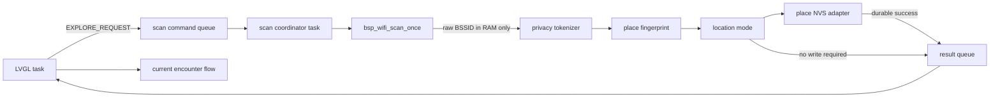

# T08 真实地点扫描接入计划

## 1. 目标

T08 把当前固件中“等待 900 ms 后直接出现小火龙”的演示路径替换为真实的
Wi-Fi 环境判断：

```text
用户选择探索
  -> 后台扫描 Wi-Fi
  -> RAM 内构建盐化指纹
  -> 地点状态机分类
  -> 已知地点 / 候选地点 / 灰区 / Wild / 扫描错误
  -> 必要时二次扫描
  -> 地点存档成功
  -> 才允许显示遭遇
```

本阶段验证的是“设备能否稳定区分地点”，不是扩大内容数量。T08 仍只使用当前
小火龙遭遇，不增加第二只精灵、云端服务、GPS、公共 BLE 或后台持续扫描。

## 2. 当前能力与缺口

| 层 | 已有能力 | T08 缺口 |
|---|---|---|
| BSP | `bsp_wifi_scan_once()`，独立 worker 调用并立即释放 Wi-Fi | 待真机测量扫描耗时和 heap |
| 隐私 | SipHash-2-4 AP Token；设备密钥 NVS adapter；原始缓冲清零 | 待真机审计 |
| 指纹 | 最强 12 个唯一 AP；至少 4 个才可用 | 待现场阈值验证 |
| 分类 | 已知、灰区、候选、Wild、扫描失败已接生产 UI | 待真机交互验证 |
| 新地点 | 最多三次扫描，间隔至少 20 秒；持久化后确认 | 待跨建筑验证 |
| 存档 | 地点目录 codec、CRC、BSP NVS adapter、最多 16 个地点 | 待真机故障注入 |
| 奖励 | 地点确认后驱动现有遭遇；捕获记录真实 place ID | 待真机闭环 |
| 证据 | Host 场景测试 | 缺少同地点 30 次、跨建筑 10 次的真机数据 |

## 3. 必须先修正的模型问题

当前 `location_mode` 在已知地点的五分钟锁定期间，会在读取新证据前直接返回
`LOCKED`。这意味着用户在锁定期内走到另一栋建筑，设备最多五分钟都不会识别
新地点，与 T08 的“60 秒内识别跨建筑移动”验收标准冲突。

T08 必须拆开两个概念：

- **地点识别与稳定性**：每次主动探索都分类新证据；锁定期可以抑制瞬时
  empty/gray 抖动，但强烈的新地点证据仍应进入候选确认。
- **奖励冷却**：限制同地点重复产出，不能阻止识别地点变化。

必须删除“锁定期间直接跳过分类”的行为，把防刷交给独立 reward guard。
规则引擎足以处理这部分，不需要 LLM。

当前实现状态：已完成。`city_location_mode_step()` 现在只用锁定期吸收同地点、
empty、sparse 和 gray 抖动；强新地点证据仍进入候选，另一个已知地点可以立即
替换当前地点，且同地点重复扫描不会延长锁定时间。

## 4. 生产架构



所有权规则：

- LVGL task 只发送命令和渲染结果，不执行扫描或 Flash 写入。
- scan coordinator 独占 location state、place catalog 和扫描中的原始 AP 数组。
- 原始 BSSID 只存在于 worker 栈或短生命周期缓冲区，生成 Token 后立即清零。
- `bsp_wifi_scan_once()` 内部的 `wifi_ap_record_t` 也包含 SSID/BSSID，复制必要
  字段后必须用不会被编译器优化掉的清零函数擦除。
- UI 只能消费不可变结果，不直接修改地点存档。
- 地点确认和遭遇可见性之间必须有持久化屏障。

## 5. 工作包

### T08.1 设备隐私密钥（adapter 已完成）

新增 `bsp_place_identity`：

- 首次启动生成 128-bit 随机密钥；
- 存入 NVS，不写日志、不进入 evidence trace；
- 后续启动读取同一密钥；
- 若已有地点目录但密钥缺失，必须 fail closed，不能生成新密钥继续运行；
- 恢复出厂设置时密钥和地点目录必须一起删除。

当前实现提供首次生成、重启读取、异常长度拒绝、目录存在但密钥缺失时
fail closed，以及同时删除密钥和目录的 factory-reset API。设备测试固件已构建，
生产固件已在 NVS 初始化后加载密钥；真机执行仍待完成。

验收：

- 同一设备重启前后，同一 BSSID 得到相同 Token；
- 不同设备或不同测试密钥得到不同 Token；
- 全仓库日志和编码格式中不存在原始 BSSID。

### T08.2 地点目录 NVS adapter（adapter 已完成）

新增 `bsp_place_store`，复用 `city_place_catalog_encode/decode`：

- NVS namespace 建议使用 `city_places`；
- blob key 建议使用 `catalog_v1`；
- 最多保存 16 个地点；
- load 失败不返回半初始化目录；
- persist 使用 encode -> `nvs_set_blob` -> `nvs_commit`；
- commit 成功后才更新内存目录和 UI；
- CRC 或 schema 错误时显示可恢复错误，不静默覆盖。

地点 ID 使用本地单调分配：

```text
next_place_id = max(existing place_id) + 1
```

达到 16 个地点时明确提示容量已满，不能覆盖旧地点。

当前实现支持空目录加载、CRC/schema 拒绝、encode 后单次 commit，以及失败时
不修改调用方目录。设备测试固件已构建，真机 NVS round-trip 仍待执行。

### T08.3 异步扫描协调器（已实现，待真机）

新增独立 FreeRTOS worker 和命令/结果队列：

```c
typedef enum {
    PLACE_SCAN_REQUEST,
    PLACE_RESCAN_REQUEST,
} place_scan_command_t;

typedef enum {
    PLACE_RESULT_KNOWN,
    PLACE_RESULT_CANDIDATE_WAIT,
    PLACE_RESULT_NEW_CONFIRMED,
    PLACE_RESULT_GRAY,
    PLACE_RESULT_WILD,
    PLACE_RESULT_UNSTABLE,
    PLACE_RESULT_SCAN_ERROR,
    PLACE_RESULT_STORAGE_ERROR,
    PLACE_RESULT_CAPACITY_FULL,
} place_result_kind_t;
```

worker 每次只处理一个请求：

1. 调用 `bsp_wifi_scan_once()`；
2. 区分 API failure、成功空扫描、有效结果；
3. 按 RSSI 选择 AP 并盐化；
4. 清零原始扫描缓冲；
5. 调用 `city_location_mode_step()`；
6. 需要确认时安排约 20 秒后的第二次扫描；
7. 需要新增地点时，先持久化目录，再 commit location state；
8. 把结果发送回 UI。

单次探索最多执行三次扫描。若三次证据仍不能形成连续一致的候选，则返回
`PLACE_RESULT_UNSTABLE` 并结束本次探索，禁止无限复核和持续耗电。
协调器在最终结果被 UI 消费前拒绝第二个请求；结果同时携带扫描前、扫描后和
启动以来最低 free heap，便于真机确认 Wi-Fi 峰值内存。

不允许在 LVGL timer 或按键回调中调用阻塞扫描。

### T08.4 修正地点状态机（已完成）

调整 `location_mode`：

- scan error 保持原状态；
- 成功空扫描或少于 4 个可用 AP 才进入 Wild；
- 已知地点匹配分数 `> 600`；
- `300..600` 为灰区，不创建地点、不发奖励；
- `< 300` 进入候选；
- 候选必须经过至少 20 秒后的第二次一致扫描；
- 第二次扫描与候选相似度必须 `> 600`；
- 锁定期内相同地点、empty 或 gray 可以维持当前地点，避免短时抖动；
- 锁定期内 `< 300` 的强新地点证据仍允许进入候选；
- 奖励冷却单独处理，不能阻止新的地点分类。

时钟使用注入的 monotonic milliseconds。设备重启后不能把旧 uptime 当作真实世界
时间；地点目录中的 `last_confirmed_ms` 只用于诊断，不作为跨重启冷却依据。

### T08.5 UI 状态（已实现，待真机）

生产 UI 至少增加：

| 状态 | 用户看到的结果 | 是否允许遭遇 |
|---|---|---|
| Scanning | 正在读取附近环境 | 否 |
| Candidate wait | 发现可能的新地点，等待复核 | 否 |
| Known place | 已识别本地地点编号 | 是 |
| New confirmed | 新地点已保存 | 是 |
| Gray zone | 环境证据不稳定，请移动或重试 | 否 |
| Wild | 附近没有足够 Wi-Fi 证据 | T08 否，T10 再接奖励 |
| Scan error | 扫描失败，可重试 | 否 |
| Storage error | 地点未保存，可重试 | 否 |
| Capacity full | 地点容量已满 | 否 |

扫描期间按键和动画必须保持响应。重复点击探索只保留一个在途请求。

### T08.6 遭遇接线（已实现，待真机）

T08 暂不实现多物种选择：

- 已知地点或新确认地点：继续进入当前小火龙遭遇；
- place ID 写入捕获记录；
- 灰区、扫描错误、存储错误不创建 encounter sequence；
- 新地点只有在目录持久化成功后才生成 encounter；
- Wild Mode 只显示状态，不在 T08 发奖励，避免抢跑 T10。

这保证 T08 只验证地点识别，不把第二只精灵的内容效果混入技术验收。

### T08.7 隐私安全日志

允许记录：

- 固件版本；
- scan result 类别；
- AP 数量；
- 扫描耗时；
- 相似度分数；
- 本地 place ID；
- 状态转换和错误码。

禁止记录：

- SSID；
- 原始 BSSID；
- AP Token；
- 公共 BLE 地址；
- Wi-Fi 凭据；
- 经纬度或可还原的精确地点。

建议日志示例：

```text
PLACE_SCAN result=evidence ap_count=9 duration_ms=2840
PLACE_CLASSIFY mode=known place_id=2 score_permille=750
PLACE_CONFIRM result=persisted place_id=3
```

## 6. 测试矩阵

### Host

- API failure 不改变状态；
- empty 与 sparse evidence 进入 Wild；
- 60.1% 为 known，60% 为 gray；
- 30% 为 gray，29.9% 为 candidate；
- 候选不足 20 秒不能确认；
- 两次候选不一致会重启确认；
- 地点存储失败时不得调用 commit；
- 奖励冷却不阻止新地点分类；
- 目录满时不覆盖；
- codec 损坏时调用方对象保持不变。

### ESP32-C3 自动测试

- 设备密钥首次生成、重启稳定；
- 真实 Wi-Fi 扫描在 worker 中执行；
- 同一探索只允许一个在途扫描请求；
- 扫描结束后 Wi-Fi 被 stop/deinit；
- 地点目录写入、重启读取和 CRC 拒绝；
- 写入前失败与 commit 后响应丢失；
- 扫描期间 LVGL heartbeat 持续运行；
- 记录扫描前、峰值和结束后的最小剩余 heap；
- production app 和 Recovery 分区 digest 不被测试流程破坏。

### 现场地点测试

同一地点：

- 固定一个咖啡店或办公室位置；
- 连续执行 30 次主动扫描；
- 错误新增地点不得超过 1 次；
- 记录 AP 数、score、分类和耗时，不记录网络标识。

跨建筑：

- 选择两个无线环境明显不同的建筑；
- 往返 10 次；
- 到达后主动点击探索；
- 至少 9 次在 60 秒内识别变化；
- 五分钟奖励冷却期间仍必须识别地点变化。

异常路径：

- 关闭或屏蔽 Wi-Fi 环境，确认 empty/sparse 与 API failure 不混淆；
- 扫描时重启；
- 地点确认写入时重启；
- NVS 满或注入写入失败；
- 连续快速点击探索；
- 第 17 个地点返回容量已满。

## 7. 交付顺序

建议拆为五个可独立审查的提交：

1. 修正 location lock 与 reward cooldown 的职责边界，并补 Host 测试。
2. 增加设备密钥和 place catalog NVS adapter。
3. 增加异步扫描 coordinator 与隐私清零。
4. 接入 UI 状态和现有遭遇流程。
5. 增加设备测试、现场采样脚本和阈值报告。

当前进度：第 1–4 步已实现并通过 Host 与固件构建，第 5 步的真机扫描、现场
阈值和功耗验证尚未执行。

每一步都必须保持 `./tools/test-host.sh` 通过。第 2–4 步分别构建固件；第 3 步
开始必须报告真机扫描结果，不能用 Host 测试代替硬件验证。

## 8. T08 完成标准

T08 只有同时满足以下条件才完成：

- 生产固件不再使用固定 900 ms 假扫描；
- 扫描不阻塞 LVGL；
- raw SSID/BSSID 不进入 NVS、日志和测试证据；
- 新地点只在两次一致扫描和持久化成功后可见；
- scan failure、empty scan、gray evidence 有不同结果；
- 同地点 30 次最多 1 次误新增；
- 跨建筑 10 次至少 9 次在 60 秒内识别；
- 奖励冷却不阻止识别新地点；
- 固件构建、Host 测试和真机重启测试分别通过。

## 9. 风险与停止条件

- **同一套 Mesh 覆盖多栋建筑**：只用 AP Token 重合率可能无法区分，需要实测
  后调整 top-N、RSSI 分桶或引入经批准的固定 beacon；不能伪造“已定位”。
- **弱 Wi-Fi 环境**：少于 4 个 AP 应进入 Wild，而不是创建低质量地点。
- **扫描功耗**：只允许用户主动触发，T08 不做后台周期扫描。
- **镜像体积**：链接 Wi-Fi 后 factory 镜像约 1.23 MiB，仍低于 3 MiB factory
  分区；它大于 1 MiB Recovery 分区，因此不得用主固件覆盖独立 Recovery 镜像。
- **密钥丢失**：禁止自动重建并继续使用旧地点目录。
- **隐私泄露**：任何日志出现原始 BSSID 都是阻断发布的问题。
- **识别指标不达标**：先调整证据模型并重测，不增加精灵内容掩盖地点能力不足。

## 10. 延期优化

以下内容不阻塞 T08 主流程，保留到真实地点证据通过后再评估：

- 超过 16 个地点的目录扩容或独立数据分区；
- 多物种地点池和图鉴 schema 扩展；
- 跨设备共享地标、GPS、服务端地图或合作场地 Beacon；
- 地点指纹老化、自动合并和多快照模型；
- 后台周期扫描、自动探索和动态扫描功耗策略。
