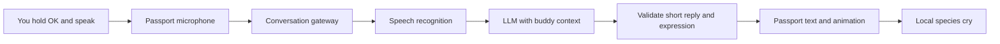

# Buddy conversation: your voice in, a cry and words out

Draft: 2026-09-14. Source baseline: local commit `dbe9027`.
This is a proposed experiment, not an implemented or device-validated feature.

## Experience to build

You speak to the buddy selected on your Passport. It responds with its existing species cry, a small expression or movement, and a short written reply on the screen. The words express what the buddy means; the cry remains its audible voice. No speech synthesis is needed.

Assumption: you want to speak directly into the Passport microphone. A phone is not part of the normal conversation interface. An online service is required for generated conversation; existing collecting, exploration, and buddy viewing remain available offline.

Example, with Pikachu selected:

> You: “I'm tired. Shall we go home?”
>
> Speaker: Pikachu's existing cry.
>
> Screen: “Let's rest together. We can explore again later!”

The first experiment should answer one question: **does talking to your existing buddy make you want to interact with it again?** Start with short conversations and real game context. Longer memory and proactive remarks follow only if this feels worthwhile.

## What the current code supports

| Area | Verified in this checkout | Work required |
| --- | --- | --- |
| Buddy identity | `bestiary_service.h` stores `buddy_species_id`; friendship is per species, although owned copies have individual IDs | Use species identity for v1; do not invent a selected individual copy |
| Audio | `bsp_audio.c` exposes microphone reads and cry playback through ES8311/I2S | Verify the microphone on this device and coordinate capture/playback ownership |
| Cry playback | `pokemon_audio.c` has an asynchronous worker and species-keyed local assets | Play the selected buddy's cry once per accepted reply; preserve volume/mute |
| Input | `bsp_button.c` exposes press, click, double click, and long press | Add release events for hold-to-talk and prevent the release becoming an extra click |
| Network | `bsp_wifi_scan.c` initializes, scans, then stops/deinitializes Wi-Fi | Add connection/session support and one owner for scanning versus connectivity |
| Display | 240×320 LVGL UI; English/Chinese settings | Add a readable dialogue page; current Chinese fonts contain only characters used in existing source strings |
| Resources | ESP32-C3 without PSRAM; this repository reserves a 3 MiB factory app partition | Measure combined microphone, TLS, Wi-Fi, UI, font, and audio resource use |

These are source observations. Microphone quality, online latency, and battery impact were not measured for this draft. The current upstream Passport layout differs from this project's recovery layout: preserve this project's `partitions.csv`.

## First version: one complete conversation

1. Add a labeled **Talk** destination to Home. If no buddy is selected, guide the player to choose one first.
2. Connect before enabling recording. Show **Connecting**, then **Hold OK to talk**. Keep **DOWN: Back** visible.
3. Holding OK begins recording after the listening indicator appears. Releasing sends the utterance. Stop automatically at 10 seconds and consume the later release/click.
4. Show **Thinking…** while speech recognition and the LLM finish. DOWN cancels immediately. Ignore any eventual result from a cancelled turn.
5. Display a short reply and play the buddy's cry once. A redraw or page change must not replay it. Show the heard transcript on a secondary page so recognition errors are understandable.
6. UP switches between reply/transcript pages. Hold OK starts another turn after stopping any remaining cry. DOWN returns Home and releases conversation resources.

Keep the buddy visible above the text. Aim for one sentence, initially at most 80 English characters or 32 Chinese characters; also measure actual pixel wrapping. If a valid reply needs two pages, indicate the page count explicitly. Do not use a desktop-style scrolling chat log on this screen.

The interaction is half duplex: record first, then play the cry. No always-listening mode, wake word, or simultaneous listening/playback is needed for this experiment. Preserve the saved mute setting and 60% default volume; muted conversations still show every reply.

## Architecture



Run a small standalone gateway on the Mac for initial development, with the Passport connected over Wi-Fi. It owns speech recognition and LLM credentials, bounded conversation context, response validation, and request limits. Move the same service to a reachable server after the device loop passes; the Mac is then unnecessary. Provider inference runs off-device.

Use one authenticated WebSocket session to the gateway, with verified TLS for the network prototype. Stream 16 kHz, signed 16-bit mono PCM in binary frames. This is 32,000 bytes/second: a 10-second recording is 320,000 bytes, so do not buffer the entire utterance on the ESP32-C3. Start with 20 ms/640-byte frames and a bounded 8 KiB ring buffer, then measure. Overflow aborts with an explicit retry state instead of silently dropping audio. The gateway can buffer the capped utterance if its ASR adapter needs a complete file.

For the initial ASR adapter, Paraformer realtime is a documented Chinese/English streaming candidate accepting 16 kHz PCM. Select the actual account-supported model and region during the microphone spike; compare alternatives only if its recognition or latency fails the gate. For text generation, start with a configurable DeepSeek model using JSON output. These are implementation candidates, not claims of a tested provider route. See the primary sources below.

### Firmware responsibilities

- Evolve the existing audio worker into a single owner of codec configuration, reads, writes, and volume. Use explicit `IDLE / RECORDING / PLAYING` states; add recording acknowledgements and cancellation. Independent tasks must not race on the codec.
- Put connection/streaming work outside the LVGL lock and button callbacks. Add a radio coordinator: scans cannot initialize/deinitialize Wi-Fi while a conversation owns the connection. End the session before resuming exploration scans.
- Give every turn a session ID, turn ID, and buddy-selection revision. Accept a reply only if all still match the active screen and buddy. Enforce a single in-flight turn and deduplicate playback.
- Allow a maximum 2 KiB reply envelope and bounded transcript/history buffers. Abort allocation failures cleanly. Measure minimum heap, largest free block, task stack margins, and app size under combined load.
- For the developer prototype, provision Wi-Fi settings and a short-lived gateway credential through USB into RAM, with echo/logging disabled. The repository currently prohibits credentials in persistence or evidence logs. Reboot requires provisioning again; durable setup is a separate design decision before an untethered trial.

### LLM responsibilities

Provide an authored species personality, the UI language, the user's transcript, and an allowlisted snapshot: buddy species/name, friendship, the health value shown by the game, evolution readiness, and coarse saved progress. Include only events the game actually confirms. Do not send raw scan data, network identifiers, precise location, the collection blob, or device identity partitions.

The LLM speaks as a friendly creature with a distinct personality. Pikachu can be lively, Bulbasaur calm, and Charmander eager; these are authored characterization choices. It can acknowledge feelings, chat about the last verified discovery, or suggest a supported game activity. It must not invent a visit, promise an evolution, or claim that a game action has happened.

Example model result:

```json
{
  "reply_text": "Let's rest together. We can explore again later!",
  "expression": "gentle"
}
```

The gateway adds session/turn/revision fields from trusted request state and validates text length, UTF-8, supported glyphs, and an expression enum (`neutral`, `happy`, `curious`, `gentle`). Firmware maps expressions to small authored animations. The cry ID always comes from the active buddy, never from model output. JSON output does not replace application validation; empty or malformed results are failures.

The LLM receives no tools that change HP, friendship, captures, release, or evolution. Asking “give me 100 friendship” cannot change the save. Chatting earns no game rewards in v1. Any future reward needs a deterministic domain rule and successful persistence.

## Text, memory, and failure behavior

**Chinese text is an early feasibility gate.** Existing subset fonts cannot display arbitrary generated Chinese. First measure a dialogue-only 14 px font covering a curated common character set within the existing partition. Export its glyph allowlist to the gateway. Validate every generated response; allow one bounded rewrite, then use an authored local failure message. Apply the same glyph checks to transcripts, marking unavailable characters explicitly. Do not silently switch the user's language or deliver missing-glyph squares. If the font cannot fit, resolve a bounded bitmap text-panel design before promising Chinese support; do not change recovery partitions to make it fit.

**Memory starts small.** Keep the latest six turns in gateway RAM, scoped to the paired session and buddy species. Clear them on session expiry, manual reset, or buddy change. The current save does not contain a full visit diary, so do not claim it remembers yesterday's conversation or every place visited. Later, add a separate inspectable/deletable summary and explicit player preferences, rather than modifying the collection blob or writing each turn to NVS.

**Handle errors as part of the interaction.** No network means voice chat is unavailable, with local buddy reactions and normal offline play still usable. Silence or unusable audio shows “I couldn't hear you. Try again.” A network/model timeout shows “Couldn't connect. Try again.” Never present a canned line as an understood answer to speech that was not recognized. On speaker failure, keep the written reply. Leaving, sleeping, changing buddy, or losing the connection cancels capture/playback and invalidates pending results.

Keep raw audio transient and disable transcript/audio logging by default. Disclose that speech is sent to the chosen service; provider retention settings must be checked when selecting the account. Log only build/provider identifiers, timing, byte counts, outcome codes, and resource measurements. Enforce per-session request limits and bounded provider timeouts. Store provider keys on the gateway only.

## Delivery sequence and acceptance gates

| Stage | Deliverable | Gate before proceeding |
| --- | --- | --- |
| 0. Prove the constraints | Microphone diagnostic, combined resource measurements, font-size trial, connection spike | Understandable, non-silent audio; no clipping at normal speaking distance; selected-language text fits; TLS/audio/UI coexist within app and RAM limits |
| 1. Make the buddy react | Talk screen, button/release handling, scripted replies, cry and expression | Record/stop/back are understandable; no duplicate cry, release-triggered extra turn, unreadable text, or frozen UI |
| 2. Complete the LLM loop | Streaming gateway, ASR, validated replies, real buddy snapshot | At least 18/20 fixed ordinary utterances preserve intended meaning in each supported language; all replies use the correct buddy; measured latency meets targets below |
| 3. Make failure boring | Cancellation, disconnects, stale replies, bounds, offline fallback | No save changes or stale text/cry after cancel/buddy switch; malformed responses and provider failures return control; 100 turns plus a 30-minute session without crash or continuing heap decline |
| 4. Decide whether to expand | Three-day owner trial with one buddy, then a second personality | Record voluntary return conversations, misunderstood utterances, latency, and whether replies feel specific to this buddy; choose one improvement before adding persistent memory |

Provisional targets: listening feedback within 200 ms after the hold threshold; release-to-visible-reply median at most 3 seconds and p95 at most 6 seconds on the chosen test network; hard deadline at 10 seconds after release. These are targets, not measured promises. Cancellation should make the UI immediately usable even when backend work takes longer to stop.

Implementation validation must keep host tests, LVGL renders, firmware builds, microphone/listening checks, real provider turns, and battery measurements separate. Include mute, maximum-length replies, unsupported glyphs, silence, noise, disconnected Wi-Fi, provider authentication failure, malformed JSON, buffer overflow, repeated button events, screen-off, and late responses. Before any installation, back up the actual device and verify its protected partitions afterward. Measure a defined conversation workload against the offline baseline before claiming carry-time suitability.

## Proposed code seams

- `components/bsp`: microphone/button adapters; extend the existing audio API only as needed.
- `main/pokemon_audio.c`: shared audio ownership and capture/playback transitions.
- `main/buddy_conversation.c/.h` (new): session state, cancellation, context snapshot, validated UI events.
- `main/buddy_transport.c/.h` and a radio coordinator (new): bounded gateway transport and Wi-Fi lifecycle.
- `main/main.c`, `main/ui_strings.c`, font generator: Talk navigation, dialogue states, localization.
- `services/buddy-gateway/` (new): standalone ASR/LLM adapters, personas, validation, temporary session history.
- Host and production-render fixtures: dialogue transitions, bounds, cancellation, and unchanged game state.

Use an opt-in build feature for the prototype. This draft authorizes no deployment, firmware installation, or save-schema change. It extends the product with optional conversation while retaining the existing offline core.

## Primary references checked for this draft

- [FoloToy hardware capability contract](https://github.com/folotoy/ai-passport#hardware-capability-contract): display, buttons, microphone/playback, and scanning boundaries. Reuse hardware facts, not upstream partition defaults.
- [ESP-IDF 5.5.3 I2S documentation](https://docs.espressif.com/projects/esp-idf/en/v5.5.3/esp32c3/api-reference/peripherals/i2s.html): driver/PCM behavior for the project's toolchain.
- [Paraformer WebSocket API](https://docs.modelstudio.console.alibabacloud.com/en/model-studio/websocket-for-paraformer-real-time-service) and [client events](https://docs.modelstudio.console.alibabacloud.com/en/model-studio/paraformer-client-events): server-side ASR integration candidate and stream lifecycle.
- [DeepSeek JSON output](https://api-docs.deepseek.com/guides/json_mode/): structured response setup and documented empty-output handling.

Local design references: [cry playback](../architecture/pokemon-cries.md), [persistent health and release](../architecture/persistent-hp-and-release.md), [settings](../architecture/settings.md), and [repository boundaries](../../AGENTS.md).
