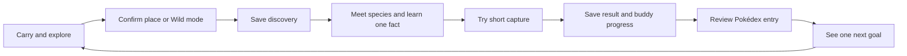

# Pokédex experience plan — TV, games, and current progress

Prepared 2026-09-11. Planning deliverable; no gameplay implementation or device installation performed in this task.

**Recommendation: build an offline field Pokédex that makes each discovery worth understanding and remembering.** Combine the TV series' companion character, the games' visible collection progress, and the Pokéwalker's reason to carry a small device. Finish and test that experience with the existing roster before expanding it again.

The central product question remains: will a player voluntarily bring this device to another place and carry it again the next day?

**What the references actually suggest**

This is a focused comparison of relevant experiences, not a survey of every Pokémon season or game. TV evidence comes from official episode summaries; episodes were not watched end to end for this plan. The adaptation column contains product recommendations, not claims about Pokémon canon.

| Reference | Verified behavior | Adaptation for this device | Gap against your progress |
|---|---|---|---|
| TV: *Sun & Moon*, “Loading the Dex!”; *Sun & Moon—Ultra Adventures*, “The Dex Can't Help It!” | Rotom inhabits Ash's Pokédex and participates as a character in the story. [Official introduction](https://www.pokemon.com/us/animation/seasons/20/episode-3-loading-the-dex), [Rotom episode](https://www.pokemon.com/uk/animation/seasons/21/episode-14-the-dex-cant-help-it) | Give discoveries a short, distinctive explanation and give the device a consistent, restrained voice through authored text. | Buddy art and bond already provide personality. Species descriptions exist in content but are absent from the detail screen. |
| Main series: *Sword / Shield* | Finding or catching Pokémon registers information in the Pokédex, which is part of the Rotom Phone. [Official feature page](https://swordshield.pokemon.com/en-us/gameplay/about-pokedex-rotom-phone/) | Treat an encounter as a valuable discovery even when capture fails; make its entry easy to revisit. | UNKNOWN / SEEN / CAPTURED and durable discovery already exist. Entry content and navigation need attention. |
| *Legends: Arceus* | A single catch does not complete an entry; further research develops it and contributes to rank progression. [Official gameplay](https://legends.arceus.pokemon.com/en-us/gameplay/) | Later, make a few repeated interactions unlock more knowledge. Begin with facts already supported by saved progress. | Catch counts and buddy-place bits are useful foundations. There is no general species research or observation history. |
| *Legends: Z-A* | Mable's research registers Pokémon through catching and evolution; requests award items such as TMs. [Official Mable page](https://legends.pokemon.com/en-us/story-world/characters/mable) | Distinguish “caught” from “obtained through evolution,” and give one clear next objective. | Evolution work already models acquisition without adding a fake catch. Passport already has goals. |
| *Pokémon GO* | Its Pokédex distinguishes unseen numbers, seen silhouettes and caught color images; it supports collection categories and search. [Official help](https://niantic.helpshift.com/hc/en/6-pokemon-go/faq/124-viewing-the-pokedex/) | Keep unmistakable discovery states. Add simple filters only when list navigation becomes a measured problem. | Four-row paging and discovery badges exist. Keyboard search is unnecessary for a three-button, 15-entry device. |
| *HeartGold / SoulSilver* + Pokéwalker | A carried Pokémon gains experience and bond through steps; route choices affect encounters, and earned Watts support short activities. [Nintendo announcement](https://www.nintendo.com/en-za/News/2010/New-Pokewalker-accessory-brings-Pokemon-training-to-the-real-world-252312.html) | Preserve the small companion device and short interactions. Use confirmed places and captures as your supported activity signals. | Buddy, place stamps and pocket controls fit this direction. The current application does not implement a step counter. |

The strongest fit is **Pokédex + companion + place-based discovery**. Research depth can become a later retention experiment. Full battle systems, maps and online social play would introduce different products and validation needs.

**Your actual starting point**

The inspected Git HEAD was `2fe37a86d5fde6f2fc07fa62ba82f6eae97b1696`. It contains the 12-species roster and buddy/capture-rendering work. Local uncommitted changes add three starter evolutions, producing 15 entries and schema 8. The working tree was being updated during inspection, so this is a dated assessment, not a claim that all development has stopped at this version.

| Capability | Current evidence | Planning consequence |
|---|---|---|
| Collection | Data-driven catalog; 12 base species, plus local Ivysaur, Charmeleon and Wartortle changes; stable species IDs | Plan around 12 catchable species + 3 evolution entries. No further roster is needed for the next test. |
| Discovery | SEEN is saved before encounter display; encounter badge preserves the previous state | Preserve this transaction and the value of unsuccessful catches. |
| Pokédex UI | Permanent Bestiary entry, four visible rows, explicit Back, detail pages, counts, latest/best stats | Improve the existing pages rather than add a second encyclopedia. |
| Species information | Catalog stores one `element` and a short description. Encounter displays element; detail displays neither element nor description | This is the first content/UX gap to close. |
| Exploration | Anonymous Wi-Fi place catalog, weighted pools, unseen priority at new places, separate Wild rules | Explain actual eligibility. Wi-Fi does not identify parks, lakes or real animal habitats. |
| Passport | Saved-place stamps, discovered/owned totals and next-goal logic | Reuse this for global goals; don't introduce another quest menu. |
| Buddy | Saved per-species friendship; +1 per successful capture, +2 for the buddy's first successful capture at each saved place, capped at 100 | Make these rules visible. Simply carrying or switching the device on earns no bond today. |
| Evolution, local changes | Active starter buddy, bond ≥30 and captures together at ≥3 saved places; target acquired once; source collection preserved | Finish acceptance and explain this project's rules. These thresholds are custom, not official starter evolution rules. |
| Save model | Aggregates per species, latest/best stats, last capture place, friendship and buddy places | There are no individual Pokémon inventories, first-seen timestamps or complete travel journals to display. |
| Reliability evidence | Fresh run: 19/19 host suites passed with address/undefined sanitizers, including evolution and NVS adapter tests | Supports host-level behavior only. No fresh firmware build, render run or physical-device test was performed here. |

Source anchors: [catalog](../../content/species.json), [model and contracts](../../components/city_domain/include/bestiary_service.h), [domain implementation](../../components/city_domain/src/bestiary_service.c), [production UI](../../main/main.c), [Passport goals](../../components/city_domain/src/passport_progress.c), [evolution design](../architecture/starter-evolution.md).

The older [ROADMAP](../../ROADMAP.md) still contains one-/three-species stages and outdated toolchain status. The [expansion proposal](pokemon-expansion.md) describes a 12-species proposal that has since been implemented. Keep those as history; use current code and versioned handoffs to judge completion.

**Your saved collection progress**

The saved schema-7 readback in [buddy/save-after.txt](../../../reviews/2026-09-11/buddy/save-after.txt) contains 23 catches across five species: Bulbasaur 5, Charmander 15, Squirtle 1, Pikachu 1, Gastly 1. This is **5/12 collected (about 42%)** in that release. Seven base species remain: Jigglypuff, Oddish, Meowth, Psyduck, Growlithe, Geodude and Eevee.

The later [capture-fix boot log](../../../reviews/2026-09-11/capture-stuck/final-boot.log) records Pikachu as buddy, 23 catches and two saved places. These are historical local device records read during this task, not a live read of the device or a representative player-retention result. The 15-entry source catalog does not prove those three forms are installed or owned on the device.

This snapshot is useful for the next acceptance run: confirm existing progress survives; inspect a known entry; find one missing species; select a starter buddy; verify its displayed evolution requirements. Don't reset this save to simplify testing.

**Target experience**

Failed captures keep the discovered entry. Failed writes show retry/error feedback and never present uncommitted ownership, bond or evolution as earned.

Keep the three Home destinations: Explore, Pokédex and Passport. “Bestiary” can be renamed “Pokédex” in the prototype when changing the relevant screens, with labels consistent across Home, list, return hints and result links.

| Entry state | What to show | Next action |
|---|---|---|
| Unknown | Number, `???`, clearly marked undiscovered state | Open a short explanation instead of silently ignoring OK. Explain that exploring can reveal it without revealing every hidden name. |
| Seen | Name, picture with a distinct SEEN treatment, type(s), one authored fact | Capture to add it to the collection. Keep the fact available after escape. |
| Owned by capture | Full image, entry fact, actual catch count, last capture source, bond | Choose buddy or view growth. |
| Owned by evolution | Full entry and “Obtained by evolution” | Show ownership without implying a wild capture. Preserve earlier species registration. |

The current UNKNOWN row ignores OK, and the detail screen is already dense. For the next iteration, prioritize name, type, one short fact and ownership; move latest/best numeric stats into a Records page only if the first layout cannot fit. Measure the 240×320 render before choosing font size. Keep explicit Back and the existing hold-to-Home behavior. If a Records page is added, expose it through a visible action menu using UP/DOWN/OK; do not silently reuse the existing UP Buddy / DOWN Evolution shortcuts for paging.

Separate encyclopedia facts from this game's rules. For example, the current single `element: Grass` is a simplified game category; the official entry identifies Bulbasaur as Grass/Poison. Add `types[]` for factual display while retaining the internal category where needed, and validate the selected roster against authoritative entries. [Official Bulbasaur entry](https://sg.portal-pokemon.com/pokedex/0001/)

Write short original summaries with per-entry source references. Do not present the current custom HP/AT/DF variation, bond thresholds or anonymous place pools as official Pokémon mechanics. Keep the existing asset provenance in [SOURCES.md](../../demo/assets/SOURCES.md) distinct from content accuracy.

**Delivery sequence**

Effort ranges below assume one experienced contributor, a working toolchain and available device. They are planning estimates, not commitments; field-test recruitment and device failures can add elapsed time. Labels here describe execution order, not a replacement for the repository's product gate.

| Step | Deliverable and scope | Dependency / rough effort | Acceptance |
|---|---|---|---|
| 0. Establish the release baseline | Record exact commit/source hash, installed image, roster and save schema. Decide whether the existing evolution work is ready for the test candidate. Update the progress summary after that decision. | First; 0.5–1 day | A reproducible package and preserved save backup; implemented, host-tested, device-tested and installed status are listed separately. |
| 1. Make entries useful | Display type(s) and one distinctive fact for existing species; improve unknown-row feedback; distinguish caught from evolved ownership; use consistent naming. | Step 0; 1–2 days | All roster entries readable in actual LVGL renders; no clipped longest names; 3–5 unfamiliar users can open, understand and leave an entry without help. |
| 2. Explain the next discovery | Reuse Passport goals and existing pool eligibility for actionable hints. Show the active buddy's real progress and the existing evolution prerequisites. | Step 1; 1–2 days | Hints never send players to catch evolution-only forms, promise a specific spawn, invent a habitat, or award progress for merely viewing a page. |
| 3. Accept the existing collection and evolution loop | Verify normal capture/save, wake, Wild cooldown, save migration and the three evolution offers on the release candidate. Include decline, save failure, retry and restart. | Steps 0–2; 1–2 days plus field time | Old catches and stamps retained; no duplicate acquisition; source remains registered; acquired form becomes buddy; no false capture increment; physical input and rendering pass. |
| 4. Test carrying motivation | Freeze the roster and candidate. Run the existing three-day external trial with 10–15 people, after technical acceptance. | Step 3; at least 3 elapsed days | Report first capture, voluntary second place and next-day carry against predeclared definitions; identify the strongest remaining friction. |
| 5. Run one extension experiment | Choose research depth, brief audio, better filters or a small content expansion based on observed behavior. | Only after the product gate | A specific hypothesis and measurable outcome; one change at a time. |

Step 2 hint examples: “Explore another saved place to look for a new entry”; “Choose Bulbasaur as buddy”; “Bond 18/30 · Places 2/3.” Treat these as examples, not readings from the user's current save. Unknown and seen priorities must consider only eligible encounter species. Keep the existing Wild opportunity cooldown and do not imply every exploration attempt can produce an immediate reward.

For evolution pacing, the present rules give a fresh starter buddy 1 point per catch plus 2 per newly credited place. At exactly three credited places it takes 24 successful catches to reach 30 bond; at ten distinct credited places it can take ten catches. This arithmetic assumes no initial bond and all catches occur while that buddy is active. Test whether that pacing supports carrying motivation before changing it.

**After the product gate: research without unnecessary infrastructure**

A small research experiment can initially derive progress from existing saved facts: discovered, owned, three actual catches, selected species' bond, and buddy-place count. Unlock one extra authored fact rather than introduce currencies and reward claims. Evolution acquisition must not satisfy a “catch three” task by itself.

Don't call `buddy_places` “places this species was observed”: it tracks places where successful captures occurred with that buddy active. If later research needs actual observation locations, introduce a dedicated per-species place bitset and migration. Do not manufacture past observations from the latest-catch field. Derive the first version's read-only progress wherever possible; any new durable fields belong to the same transactional save owner as collection progress.

Preserve UNKNOWN / SEEN / CAPTURED as discovery/ownership state. Research completion is a separate dimension, and acquired-by-evolution is an acquisition source. A single linear `unknown → seen → caught → researched → evolved` enum would mix unrelated concepts and make future behavior difficult to reason about.

Content remains compiled into firmware; player progress stays in NVS. No server is needed for this plan. Keep the existing 3 MiB application partition, 24 KiB NVS partition and recovery contract. The local 15-entry schema-8 payload is 336 bytes, which is only the blob size, not total NVS allocation. The hardware is ESP32-C3 without PSRAM, with a 240×320 display and three buttons. [Partition layout](../../partitions.csv), [hardware constants](../../components/bsp/include/bsp_pins.h), [repository constraints](../../AGENTS.md).

Retain the expansion proposal's 256 KiB app-space reserve as a release target; measure the actual image and scan/render memory peaks. A bound of 32 catalog entries or an estimate for 24 is not verified device capacity. Optional audio needs a measured resource budget and visible play/mute controls; don't add automatic cloud narration to the offline core.

**Evidence and decision gates**

The next field trial should follow the existing [ROADMAP definitions](../../ROADMAP.md): at least 80% first capture within three minutes without help, 40% voluntary second-place exploration within three days, and 30% next-day carry/start without developer reminders. Report carry and start separately. Fix the denominator to enrolled participants, report missing records, and do not present a 10–15 person pilot as a stable retention estimate.

Before that trial: same-place testing should produce at most one false new place in 30 scans; at least 9/10 cross-building checks should identify the change within 60 seconds after exploration scanning starts. Complete the planned two-hour carrying scenario, real battery checks and 30-minute device stability run. These remain acceptance targets, not results established by this plan.

Observe whether players voluntarily open the Pokédex and can name their next desired discovery. Use those observations diagnostically in this first trial, rather than inventing a new numerical growth target. With no trusted date source, collect next-day evidence through the trial diary/observation process; boot counters alone cannot prove it.

Fresh verification for this planning task: `./tools/test-host.sh` passed **19/19**, using the existing CMake installation found through the prior build cache. The first attempt could not find CMake on PATH; the corrected invocation succeeded. [Host log](../../../reviews/2026-09-11/pokedex-plan/host-tests.log). Prior device/render evidence was inspected in [twelve-species handoff](../../../reviews/2026-09-11/twelve-species/handoff.md), [buddy handoff](../../../reviews/2026-09-11/buddy/handoff.md), and [capture-fix handoff](../../../reviews/2026-09-11/capture-stuck/handoff.md). A stored buddy render preview was visually inspected; no new UI test or firmware/device execution was performed.

Immediate next ticket: **make the existing species detail page teach one memorable fact, show accurate type information, and explain how the player obtained that entry.** Then verify that it makes the next outing more purposeful.
